# Managing Events

--8<-- "source-notice-en.md"

## How to manage existing events

A list of your existing events page displays the name of each event. In the event admin page you can review your settings and make changes as needed.

1. In the Jam landing page navigation, choose **Host**, the choose **Manage your existing events**.

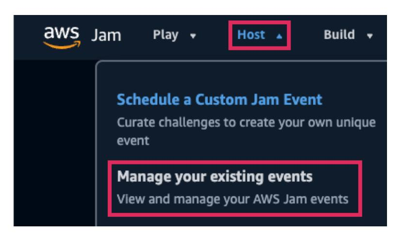

2. A list of your existing events page is shown. You can see the *title*, *channel*, *start date*, *end date*, *max participants*, and *status* of an event(s).

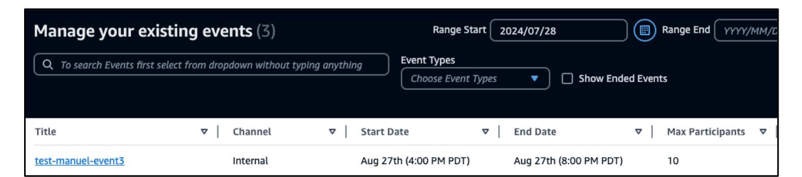

3. You can narrow your search by property, date range, event types, and ended events.

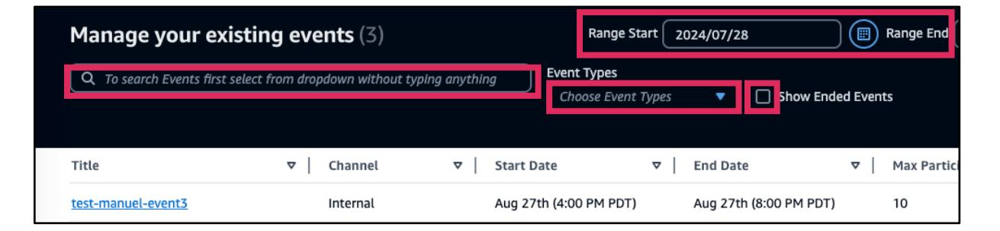

4. Choose **search**, then choose a property from the dropdown without typing anything.

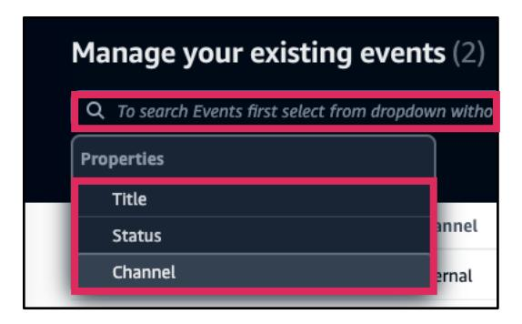

5. You can search by date range. Choose a *Range Start* and *Range End* by entering a date in the format **YYYY/MM/DD** or choose **calendar icon** to pick a date.

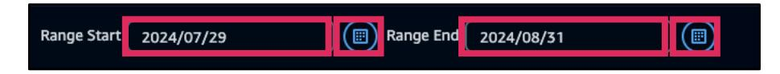

6. **Check** the box **Show Ended Events** to show ended events. You will see events with *ENDED Status*.

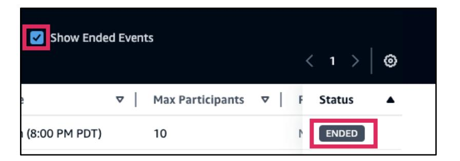

7. Choose the **column title** to change between **ascending** and **descending** sort order.

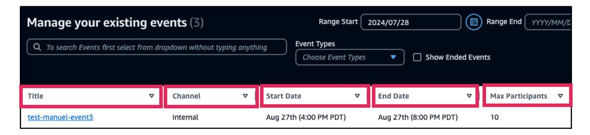

8. Choose the **title** of the event you want to manage.

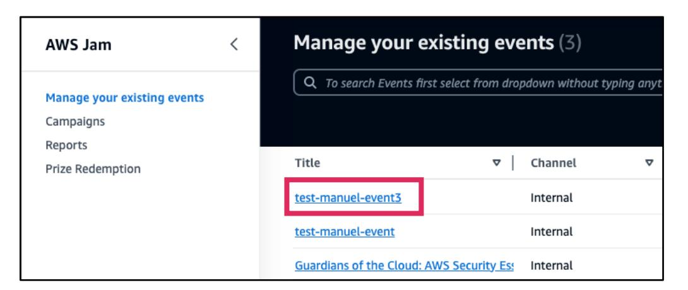

9. The event admin page shows a summary of your event such as timeline, event access, event overview, team settings, and preparation guide.

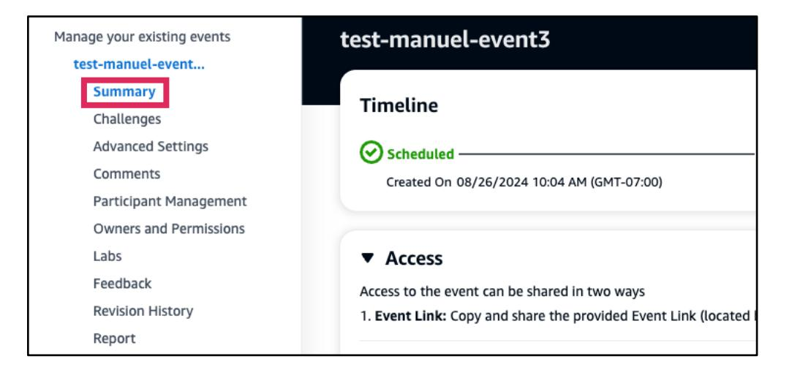

10. The *Timeline* shows important dates and time about your event.

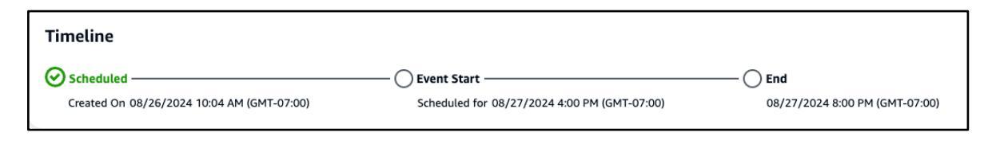

11. The *Access* panel shows the **event link** that you can share with participants.

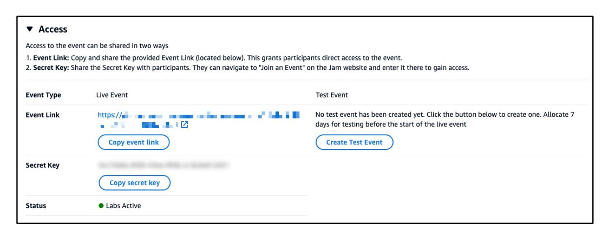

12. The *Event Overview* panel shows details about the event such as title, start and end times, number of participants, channel, and privacy type.

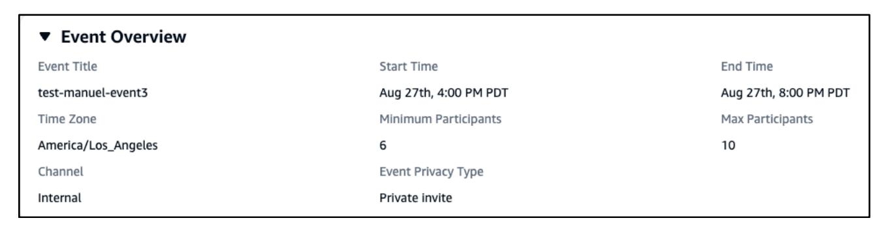

13. The *Team Settings* panel shows information about the team assignment, size, forming start time, and ability to rename teams.

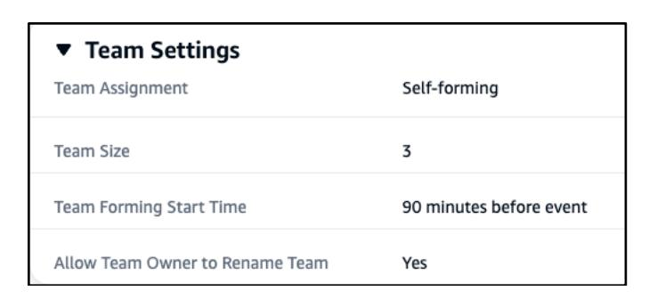

14. The *Preparation Guide* section shows links to **FAQ** pages for the following: *For Event Owners*, *For Facilitators*, and *For Learners*.

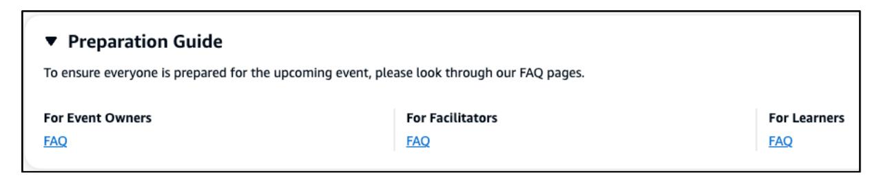

15. Choose **Actions** on the top right of the page to show the actions you can choose to take for the event:
	- a. **Unlock Challenges**: This option unlocks the challenges when the event starts. > **📝 Note:** A facilitator must unlock the challenges manually if you did not set it to automatically unlock.
	- b. **Book this event again**: This option enables you to create this event again using all the settings and challenges selected in it.
	- c. **Cancel Event**: This option enables you to cancel the event if needed.

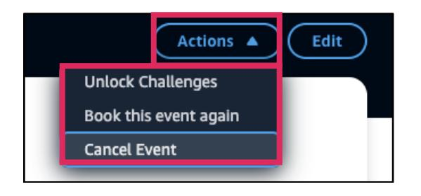

16. Choose **Edit**, if you need to make changes to any setting in the *Event Overview* or *Team Settings* panel.

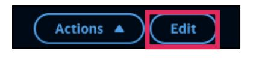

17. On the left menu choose the **Challenges** link to manage your selected challenges.

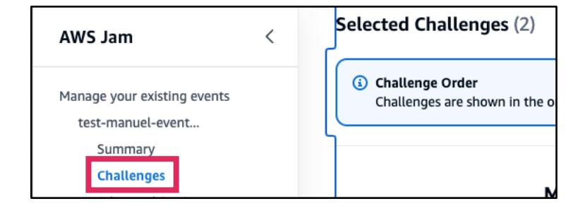

18. The *Selected Challenges* tab and the *Selected Challenges* page shows the total number of selected challenges next to it. You can see the *Max score* points and how long the event is estimated to take in the *Estimated Time For All Challenges*.

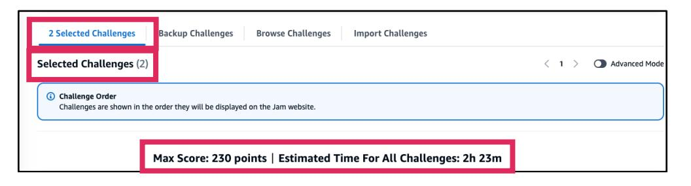

19. You can also see the challenges below that with basic information in each individual challenge.

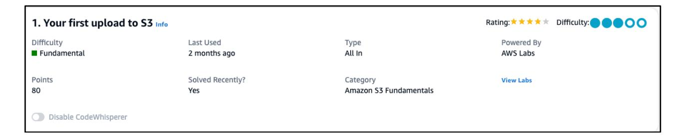

20. You can see more information about each challenge by choosing to turn **on Advanced Mode** located on the top right side of *Selected Challenges* page title.

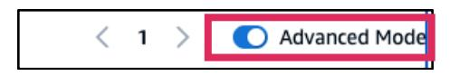

21. Advanced Mode shows additional information about a challenge such as *Average Solve Time*, *Last Solved*, *AWS Services*, *Tags*, *Average Deploy Time*, and *Warmup*.

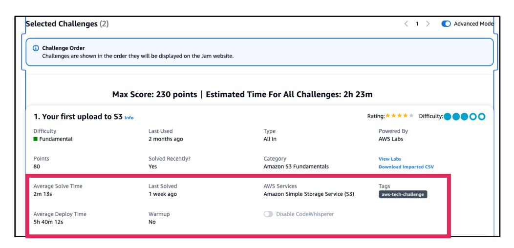

### How to access your event

1. In the Jam homepage navigation, choose **Host**, the choose **Manage your existing events**.

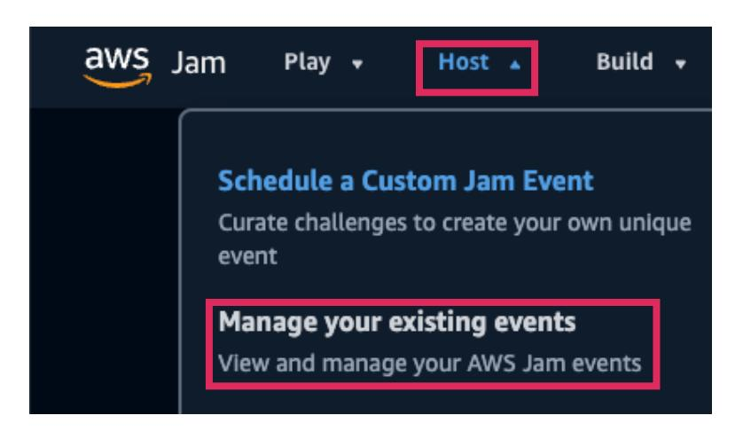

2. A list of your existing events page displays the name of each event. Choose the **event title** you want to access.

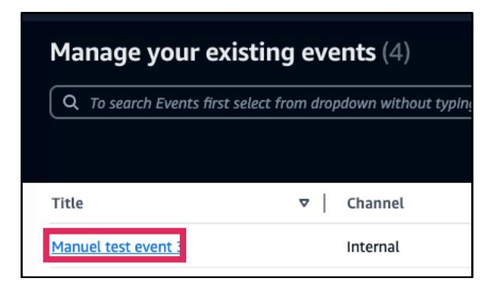

3. The event admin page is displayed.

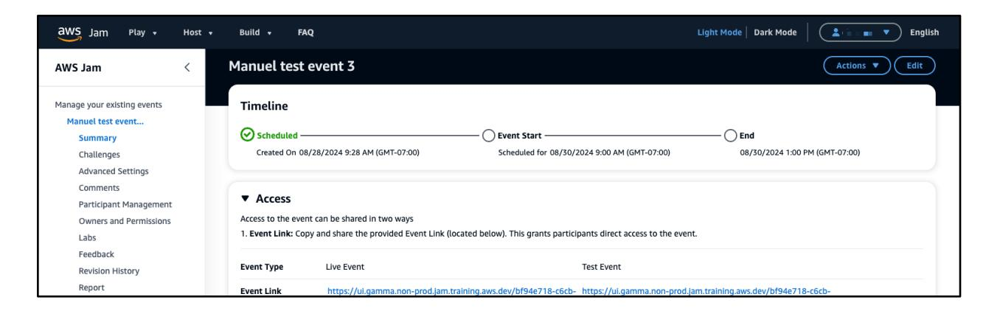

## How to change the number of participants in an event

1. In the Jam homepage navigation, choose **Host**, the choose **Manage your existing events**.

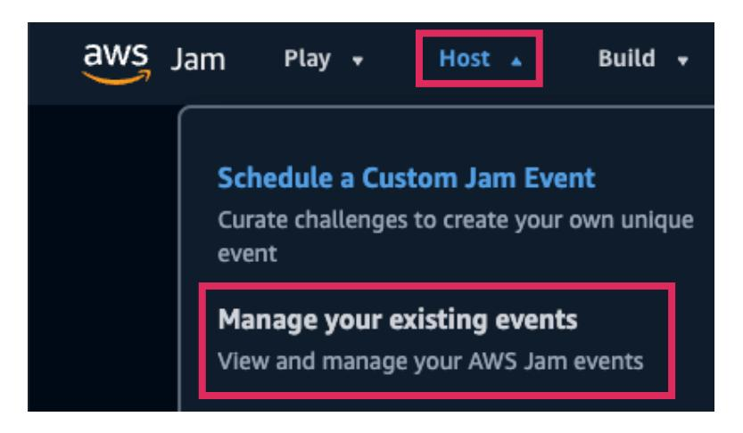

2. A list of your existing events page displays the name of each event. Choose the **title** of your existing event.

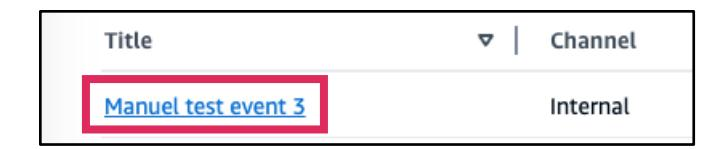

3. In the event page select **Edit**, on the top right of the page.

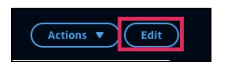

4. In *Event Overview*, go to *Number of participants* and change the **number** in **Minimum participants** and **Number of participants** as needed.

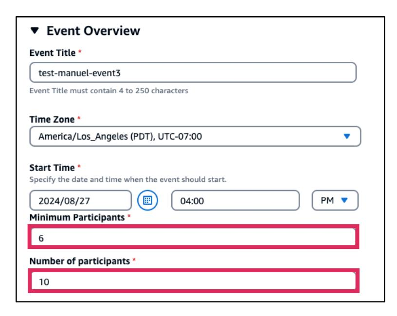

5. When done, choose **Save**, on the top right of the page.

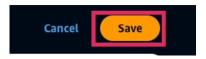

### How to change the time and date of an event

1. In the Jam homepage navigation, choose **Host**, the choose **Manage your existing events**.

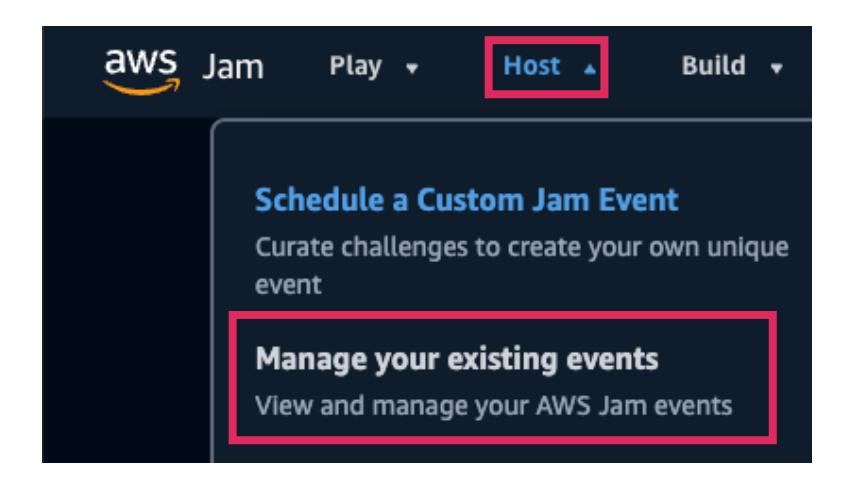

2. A list of your existing events page displays the name of each event. Choose the **title** of your existing event.

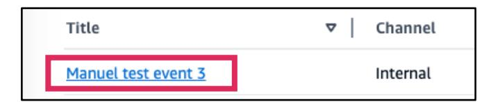

3. In the event page select **Edit**, on the top right of the page.

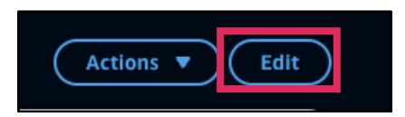

4. In *Event Overview* panel, go to **Start Time** and change the **date** and **start time**.

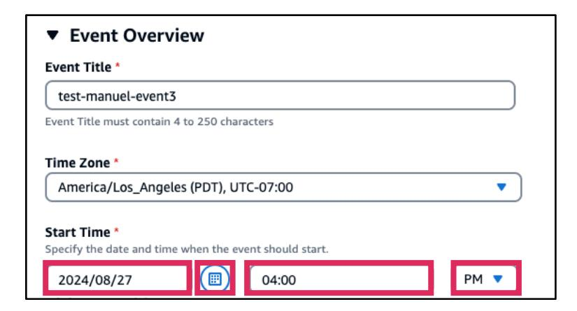

5. When done, choose **Save**, on the top right of the page.

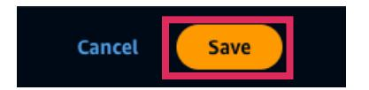

### How to test a Jam event

1. In the Jam homepage navigation, choose **Host**, then **Manage your existing events**.

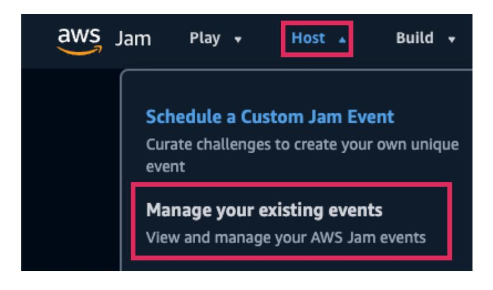

2. A list of your existing events page displays the name of each event. Choose the **event title** of your existing event to open the event admin page.

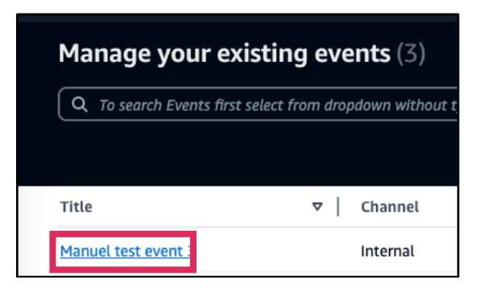

3. Go to the *Access* panel to see the test *event link*. The Event Link shows the event link of the Test Event. If there is no link, choose **Create Test Event**.

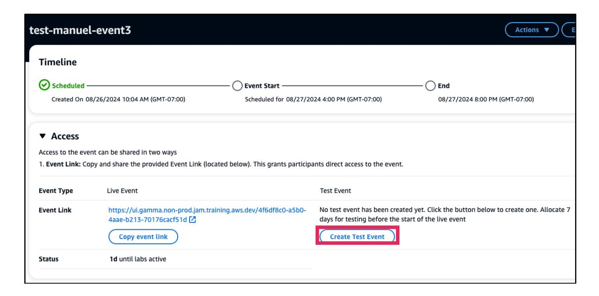

4. A test event link will be made and will display. Choose the **test event link** to open the test event in a new browser tab or window. Choose **Copy secret key** to send to testers. You can see the *Test Labs Active* status color below the *Copy secret key* pill. > **📝 Note:** A tester must be invited by the event owner to access the test event.

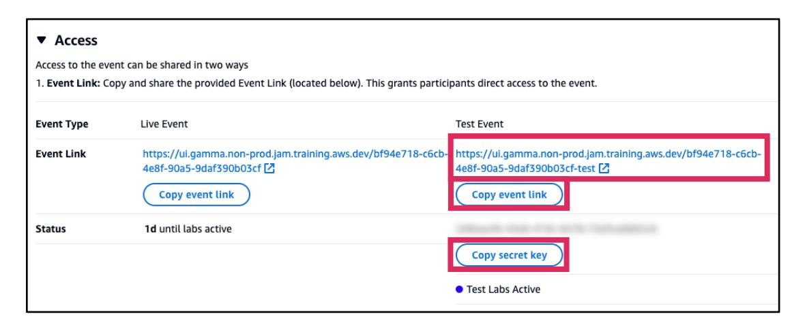

### How to know more about a challenge

1. In the Jam homepage navigation, choose **Host**, the choose **Manage your existing events**.

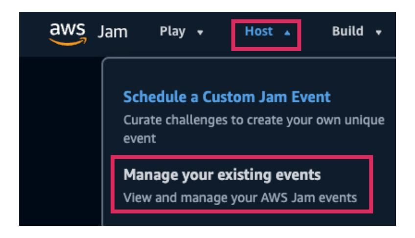

2. A list of your existing events page displays the name of each event. Choose the **event title** of your existing event to open the event admin page.

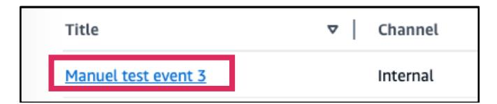

3. At the Challenges step browse for challenges. For any challenge you want to know more about choose the **challenge title**.

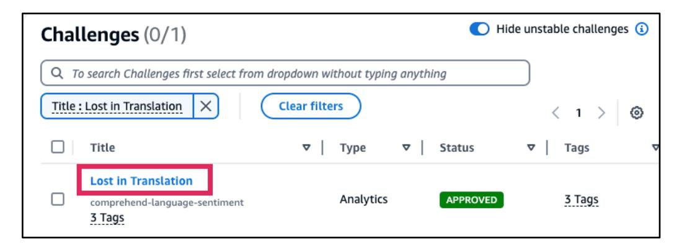

4. The challenge information panel will display on the right side. You can know more about the rating, difficulty, description architecture, and more.

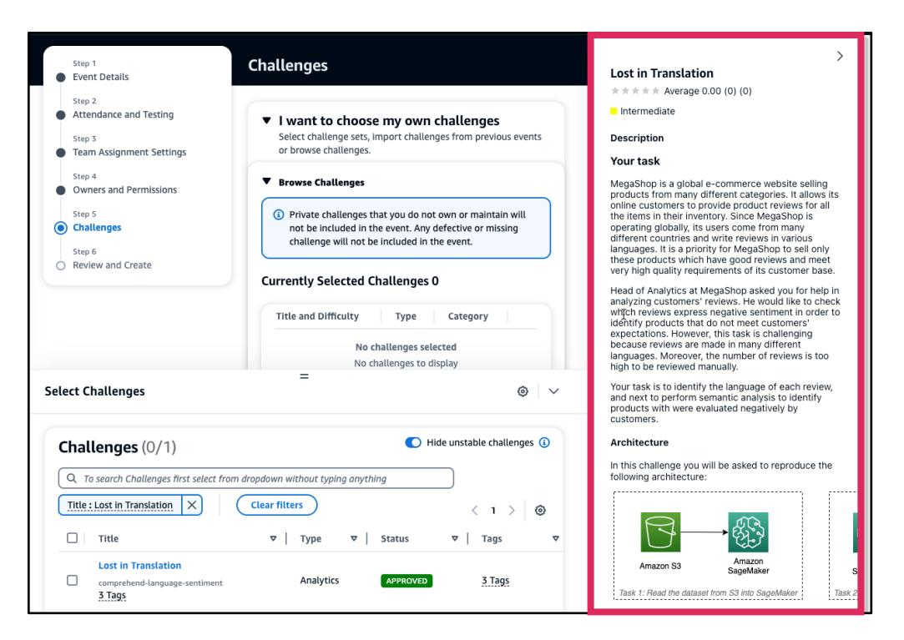

5. To see the challenge details in a larger view scroll down on the challenge information panel and choose **Go to Challenge Details**.

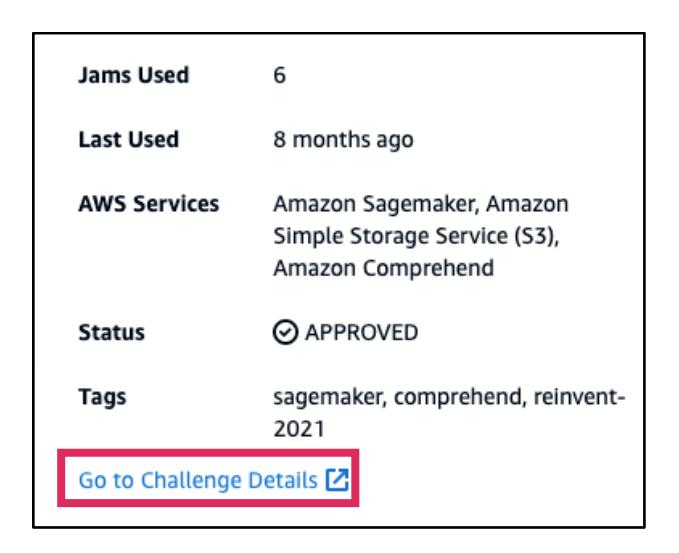

6. The *challenge details* page opens in a new browser window. You can see additional details about the challenge in a larger view browser window.

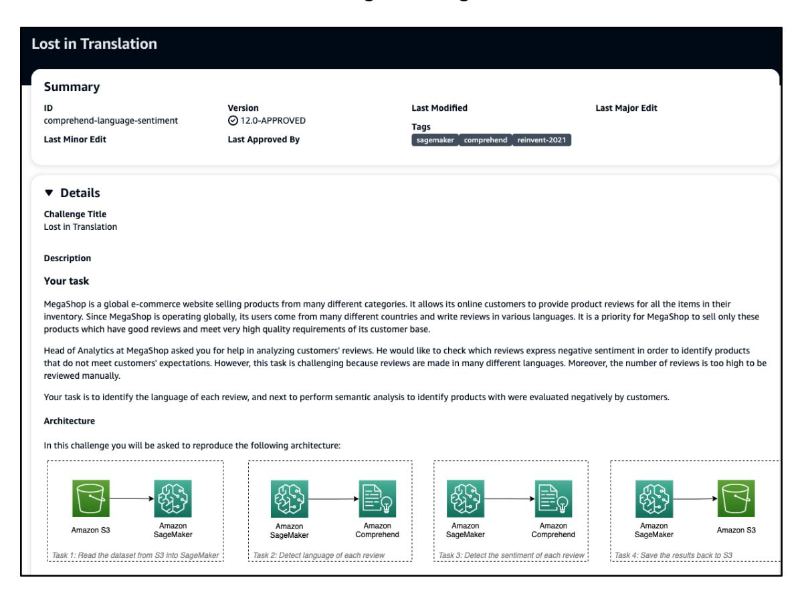
