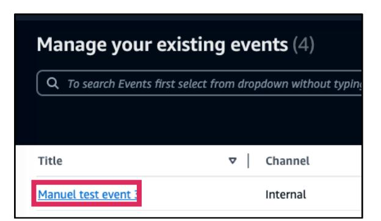
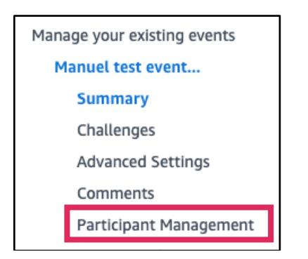
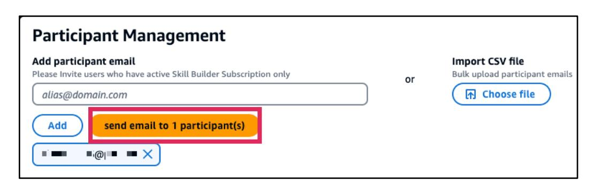
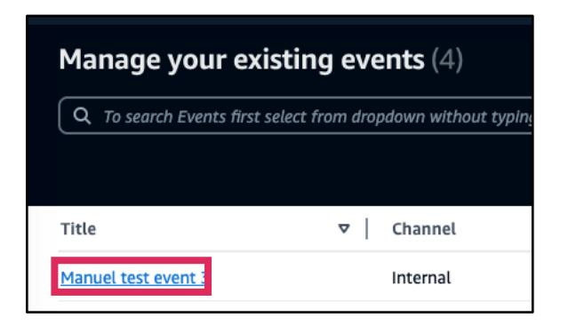
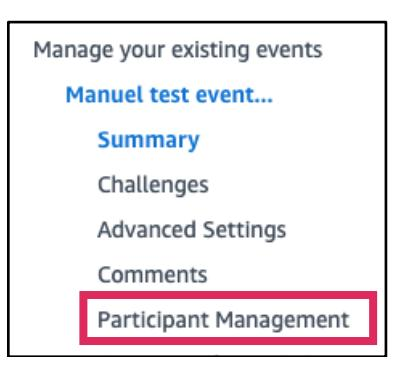
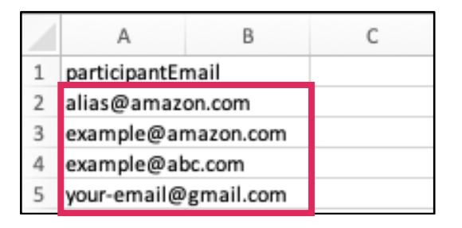
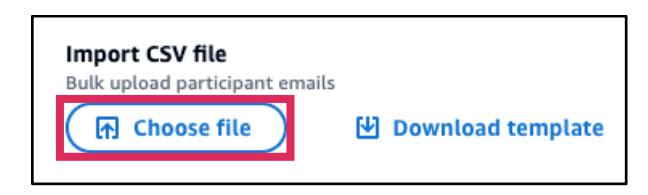
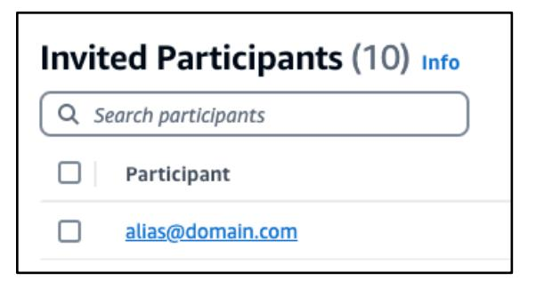
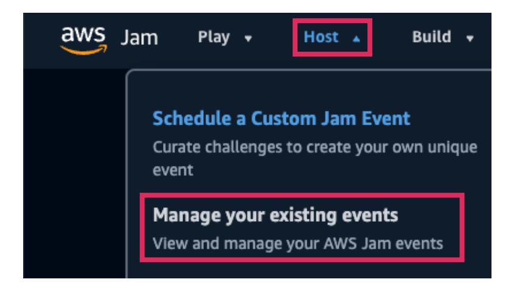
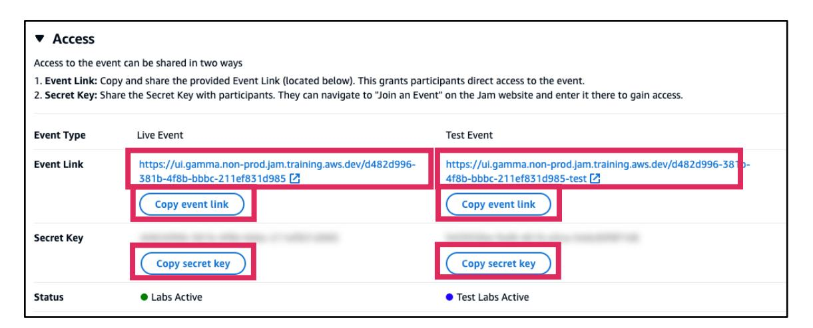

# Managing Participants

--8<-- "source-notice-en.md"

## How to invite participants to an event

For events that have been configured as *Private invite* for the event privacy type, then you would to invite participants by email. If a participant has not been added to the *Invited Participants* list, they will not be able to enter the event. > **📝 Note:** For events that have been configured as *Private Code* participants can enter events using the *event link* or by entering the *secret key* in **Join an Event** in the Jam homepage navigation **Play** menu.

**IMPORTANT***: A Jam learner must be a Skill Builder Team Subscriber in order to participate in a Jam event.*

1. In the Jam homepage navigation, choose **Host**, the choose **Manage your existing events**.

2. A list of your existing events page displays the name of each event. Choose the **event title** you want to access.

3. The event admin page is displayed. In the event management menu on the left choose **Participant Management**.

4. The *Participant Management* page is where you can add participants. In *Add participant email*, type only one *email* at a time, then choose **Add**.

5. The email invite list is shown. When done entering emails, choose **send email to (number) participant(s)**.

6. The Save and Send Email Invitation panel is shown confirming the number of added participants. Choose **send email to (number) participant(s)**.

7. The *Invited Participants* list is updated with the most recent *participant email(s)* invited.

## How to invite participants to an event using bulk upload

You can invite participants in bulk using a CSV file instead of entering it manually one at a time.

**IMPORTANT***: A Jam learner must be a Skill Builder Team Subscriber in order to participate in a Jam event.*

1. In the Jam homepage navigation, choose **Host**, the choose **Manage your existing events**.

2. A list of your existing events page displays the name of each event. Choose the **event title** you want to access.

3. The event admin page is displayed. In the event management menu on the left choose **Participant Management**.

4. You can add multiple emails with *Import CSV file*. Choose **Download template** and save the file *InviteParticipantTemplate* somewhere in your computer filesystem.

5. Open the InviteParticipantTemplate.csv file and type in the **emails** of your invitees. **Save** the csv.

6. **Choose fle**, locate and **Open** the *csv file.*

7. You will see the *CSV* name, size and date information. Choose **Send Invite For Upload CSV**.

8. The *Invited Participants* list is updated with the most recent *participant email(s)* invited.

### How to share the event links

1. In the Jam homepage navigation, choose **Host**, the choose **Manage your existing events**.

2. A list of your existing events page displays the name of each event. Choose the **event title** you want to access.

3. In the event summary navigate to the *Access* panel to find the event link. *Event Link* shows the URLs which grants participants direct access to the live event or testers to the test event. Choose **Copy event link** and share it to your invitees or testers using your choice of method.

The *Secret Key* is displayed if the event was configured as *Private code* for the event privacy type. Copy the secret key and send to participants or testers for so they can enter the event using the "**Join an Event**" in the Jam homepage navigation.

