# Event Owners Guide

This section covers how to create, manage, and run a Jam event.

## Creating events

You must be logged in to the Jam admin console. If you do not see the **Host** menu then your account has not been assigned the event creator role. If you are an Amazonian, you will have event creator access and will not need to request access. If you are external to Amazon, you need to have a current Skill Builder team subscription.

**IMPORTANT***: A Jam learner must be a Skill Builder Team Subscriber in order to participate in a Jam event.*

## How to schedule a custom Jam event

You would schedule a custom Jam event if you want to choose specific challenges for your own unique Jam event. This process has six steps: *Event details*, *Attendance and Testing*, *Team Assignment Settings*, *Owners and Permissions*, *Challenges*, and *Review and Create*.

1. In the Jam landing page navigation, choose **Host**, then **Schedule a Custom Jam Event**.

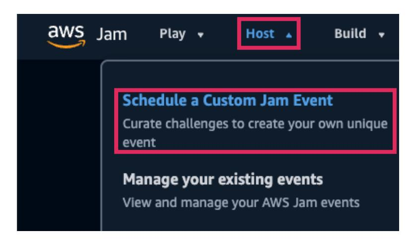

## *Step 1 Event Details (How to enter event dates and times)*

The *Event Details* page is displayed. The first step to scheduling a custom Jam event is to complete basic details for it. You will set up basic information such as the title, who the event is for, how learners will access the event, and event times.

1. In the *Event Overview* panel, complete the following:
	- a. **Event Title**: Enter a title for your event between 4 and 250 characters.
	- b. **Channel**: Choose from one of the following as the audience of the event.
		- i. **Skill Builder Event** An event available only to customers with an active Skill Builder Team Subscription.
		- ii. **AWS Classroom Builder Labs**  An event available only to customer as part of Instructor-Led-Training.
		- iii. **Internal** An event available only to Amazonians.
		- iv. **Public**  An event open to the public.
		- v. **Global Partners**  An event available to Global Partners.
		- vi. **AWS Education**  An event that is exclusive for AWS Education programs
		- vii. **Recruiting**  An event used for internal recruiting at AWS.

2. In the *Event Privacy Type* panel, choose one of the following:
	- a. **Public** You will hold a public event that is open to all learners. There will be no access control.
	- b. **Private code** You will configure an event secret key for learners to access the event with.
	- c. **Private invite** You will provide an email in *Participant Managemen*t for learners to access the event.

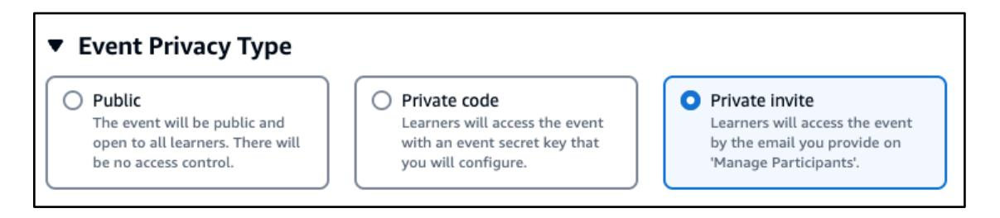

3. In the *Event Times* panel, complete the following:
	- a. **Time Zone**: Choose the time zone where your event is located.
	- b. **Start Time**: Enter a start date in the format **YYYY/MM/DD** or choose **calendar icon** to pick a date. Then enter the start time in the format **hh:mm** and then, choose **AM** or **PM**.
	- c. **Duration**: Choose from **4 Hours**, **8 Hours** or **Specific**. > **📝 Note:** A duration over 8 hours will require a manual approval. If you anticipate this schedule your event weeks in advance to anticipate a delay in approval.
	- d. **IMPORTANT** (Optional) **Automatically unlock challenges**: By default a facilitator must manually unlock the challenges during the event. You can automatically unlock challenges by enabling this feature. **Check** the

box then enter a **number** of minutes the challenges should be automatically unlocked after the event starts. > **📝 Note:** 0 minutes will automatically unlock the challenge at the event start time.

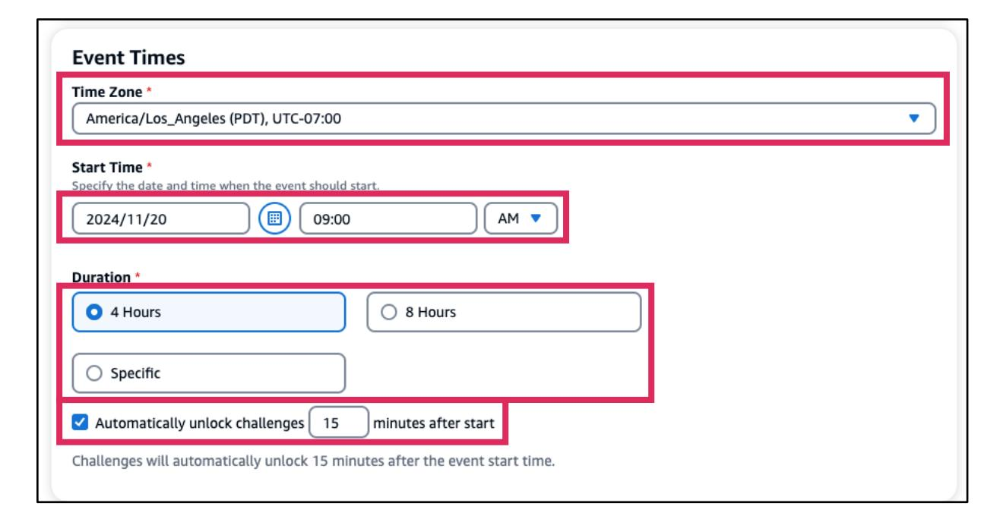

4. (**Optional**) In the *Notes* panel, enter any **details** you and facilitators need to know at the event. Participants will not see your notes.

5. When done entering event details, choose **Next**.

## *Step 2 Attendance and Testing (How to set the number of participants and team size)*

The *Attendance and Testing* page is displayed. This second step is where you configure your estimated number of participants and the team size. Your estimate should be as accurate as possible. Also, this is where you choose if this is a live event or test event.

**IMPORTANT***: A Jam learner must be a Skill Builder Team Subscriber in order to participate in a Jam event.*

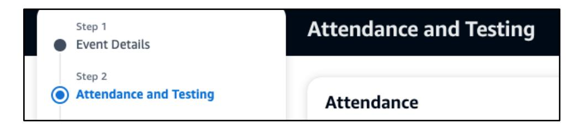

1. In the *Attendance* panel complete the following:
	- a. **Number of expected participants**: Enter the lowest **number** of participants you expect and the higher **number** of total participants. > **📝 Note:** A number above 100 participants will require a manual approval.
	- b. **Team size**: Enter a number of participants per team. > **📝 Note:** Keep the size limits between 3 and 6 participants. Anything outside the limits could delay the approval of the event.

2. In the *Event Type* panel, choose one of the following types:
	- a. **Live Event**: Choose this for a live event where participants will complete challenges. A test event will be made available for a live event.
	- b. **Test Event**: Choose this if you want to run an event only to test challenges. (Optional) **Check** *Allow access only to specific users* to enable this feature. You can choose who to allow in *Owners and Permissions*.

3. When done with Attendance and Testing details, choose **Next**.

## *Step 3 Team Assignment Settings (How to configure team settings)*

The *Team Assignment Settings* page is displayed. This third step is where you configure how teams are formed, the team size, when teams can be formed, and if you want to allow team renaming.

1. In the *Team Assignment Settings* panel choose one of the **Team Types**:
	- a. **Self-forming (Default)**: This option presents participants with system suggested team to join based on their self-reported skill level and their goal of play-to-win or play-to-learn. Participants will also have the option to create a new team or create and join a password protected team with their peers.
	- b. **Skill-based**: Participants will be grouped into teams based on their selfreported skill level and will not be able to choose or create teams. An event facilitator must initiate the team assignment and compose teams with either similar or diverse skill levels.
	- c. **Pre-created**: Use this option when instructing participants to join a specific team. An event owner must create teams in advance from the Participants section on this page as participants will not be able to create new teams. > **📝 Note:** This cannot be done until after this event has been approved.

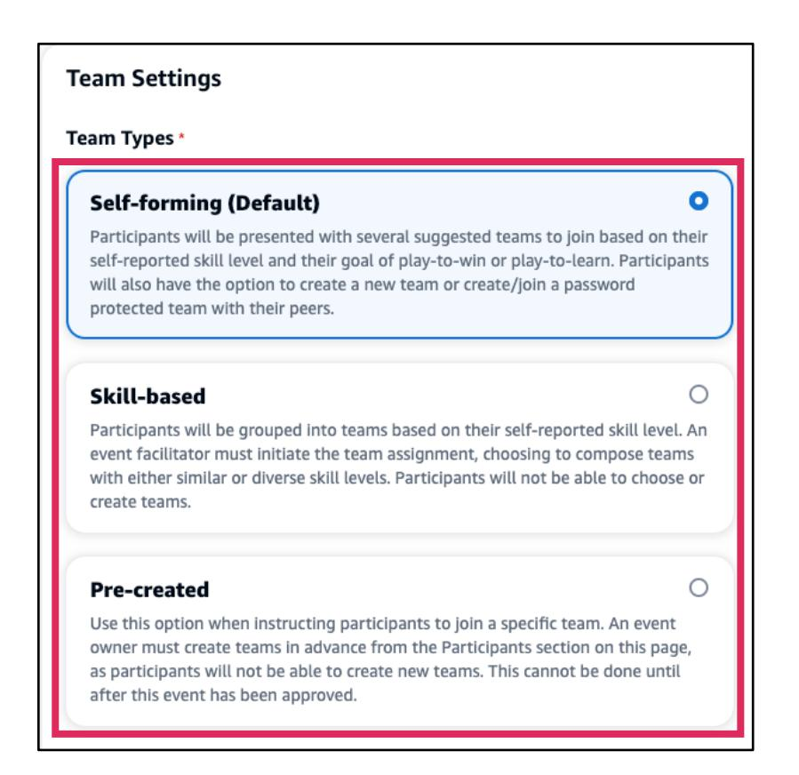

2. In *Team Size* enter a number of participants per team. > **📝 Note:** Keep the size limits between 3 and 6 participants. Anything outside the limits could delay the approval of the event.

3. The *Team Forming Start Time* setting helps to reduce the number of participants who join a team and then forget to come back when the event starts. In **Teams cannot form until**, enter a **number** in minutes before the event start time.

4. The *Team Name* setting controls the ability of the team owner to edit their team name anytime during the event and only applies to team owners. Facilitators will always be able to edit team names. To enable the changing of team names by the team owner **check** to **Allow team owner to rename team**.

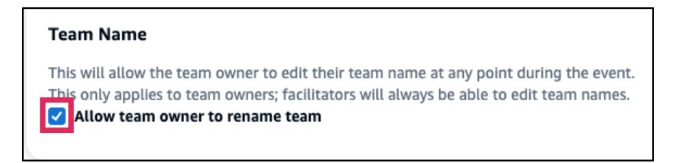

5. When done with *Team Assignment Settings*, choose **Next**.

## *Step 4 Owners and Permissions (How to add owners and permissions)*

The *Owners and Permissions* page is displayed. This fourth step is where you can add event team members and set permissions. This is also where you can enable messaging between facilitators and participants, enable chat support, and enable team members chat and create meetings.

1. The *Owners and Permissions* panel used to add event team members and manage their permissions. In the input field enter the **email address** of the user you want to add to the event, then select **Add**. The added users will receive an email to verify their email address prior to joining the event.

2. The *Permissions* section shows all event team members you have added to the event and their permissions. You can select a member's permissions by toggling **on** the role that is in the same row as their email. To remove a user choose **X** on the users **row**. > **📝 Note:** The original event owner has all three roles by default and cannot be removed. You can choose only one role per member. The order of permissions from most to least is: *Event Owner*, *Facilitator*, and *Support*. When you choose a role, the user gets all of permissions below that also. For example if you choose the *Facilitator* that member also gets *Support* permissions.

3. The *Support and Collaboration* section is where you enable the support and team collaboration using chat and meetings. You can enable/disable the following based on your event requirements:
	- a. **Support Chat**: This option is disabled by default. If this option is enabled, participants can request a chat with a support member. > **📝 Note:** For virtual events we recommend enabling the chat support option. This enables facilitators to provide support virtually. Only enable this option is there is an event team member dedicated to monitoring the support chat queue.
- **b. **Team Chat****: This option is enabled by default. If this option is disabled, participants will not be able to start team chats/meetings with their team for the event.
- **c. **Facilitator Messaging****: This option is enabled by default. If this option is disabled, facilitators will not be able to send messages to teams and/or participants for the event.

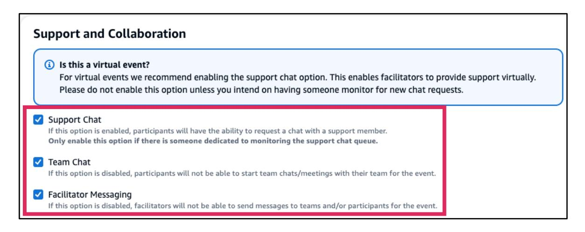

4. When done with *Owners and Permissions* settings, choose **Next**.

### *Step 5 Challenges (How to add challenges to an event)*

The *Challenges* page is displayed. In this fifth step, you choose what challenges you will have for participants to solve. You can choose it individually, use curated challenge sets, or use challenges from a past event.

1. In the *Challenges* page the **I want to choose my own challenges** panel is maximized and shows the **Browse Challenges** panel, which is also maximized. Choose **Select challenges** to browse the challenge library and to pick challenges to use for your event.

2. The *Select Challenges* panel shows the challenge library. To the right of the *Challenges* title the count of challenges you have chosen out of the available challenges to choose from the list below that. The count changes based on your filters. The **Hide unstable challenges** is enabled by default. You can **toggle on**/**of** this option to hide/show unstable challenges.

3. Choose the *search* field without typing anything to show the *Properties* panel. You can filter challenges based on its properties. The available properties are the following: **Title**, **Status**, **Owner**, **Category**, **Difculty**, **AWS Service**, and **Tag**.

4. Choose a property to show *Operators* which are used to find more specific challenges. You can choose between two operators as follows:
	- a. `**=**` **Equals**. This operator is used to find a string of text exactly as you typed in the challenge property.
	- b. `**:**` **Contains**. This operator is used to find a string of text that is found anywhere in the challenge property.

Type the text after the operator and it will automatically update with a list of challenges that are available. If the list is empty, start your search over this time using new search terms. If the challenge list is empty again, the challenge probably does not exist. > **📝 Note:** In this example the word "*lost*" is searched within **Title** of all the challenges with the `**:**` **Contains** operator.

The *Challenges* panel shows a list of challenges with your specific filters applied. If you want to add a challenge to the event, **check** the box to the left of the *challenge title*. The *Challenges* count is updated with the number of challenges selected from the available shown.

The *Currently Selected Challenges* section is also updated and shows all your chosen challenges. You can remove the challenge by choosing **X**.

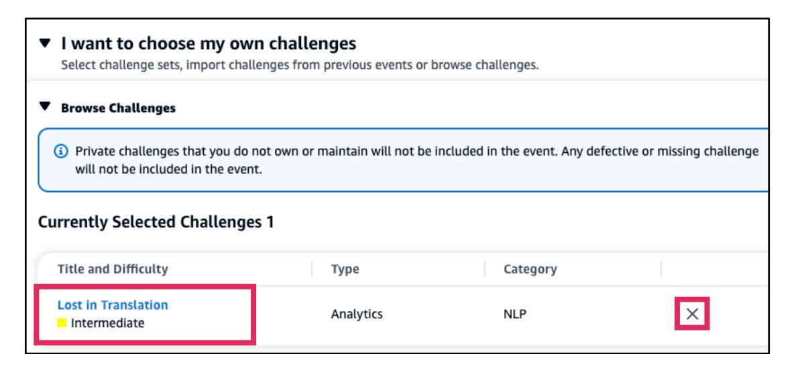

You can narrow down challenges by applying additional filters in *search* in the *Challenges* panel of the *Select Challenges* section. In this example "*s3*" is typed and the value "*AWS Service = Amazon Simple Storage (S3)*" is chosen.

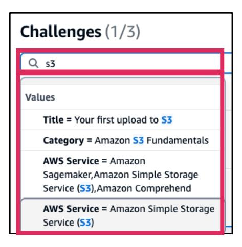

You can change the filter logic of two or more *filters* by choosing **and**/**or** found on the left of a second **flter** and later filters. You can remove filters by choosing **X** to the right of each filter. > **📝 Note:** If your search returns empty, you can try improve your results by removing individual filters and/or changing the filter logic using **and/or** operators. Add a **check** next to the challenge name of the challenge(s) that you want to add.

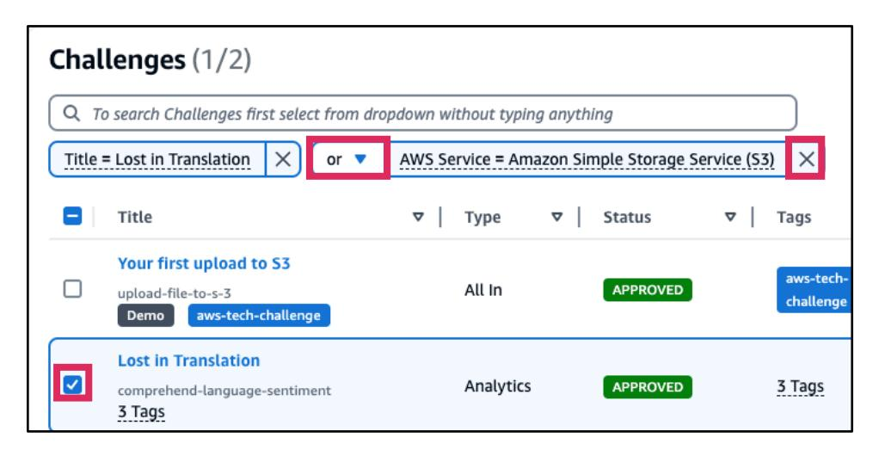

5. You can add backup challenges which are used in the event if a primary challenge has a problem deploying. Choose **Backup Challenges**, then choose **Add general backup challenges** to open the Select Challenges section and use the search challenge steps shown earlier to find backup challenges.

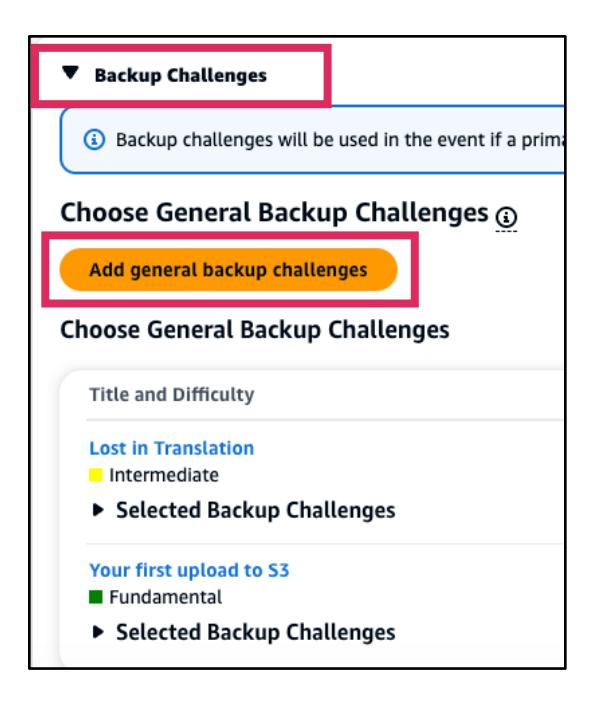

6. You can also use challenge sets which are preset challenges to use to populate your selected challenges list. Choose **Challenge Sets**, then choose an **set** in the *Choose Challenge Set* dropdown.

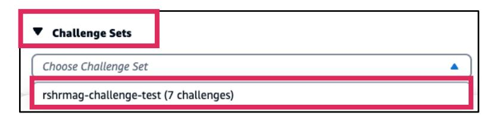

7. When you choose a challenge set, it will replace any previously selected challenges and will populate it with all the challenges belonging to the set. You can remove an individual challenge of the set by choosing **X**. You can add more challenges by choosing **Select more challenges**. You can remove the entire challenge set by choosing **X Remove** to the left of the challenge set name in the *Challenge Sets* panel.

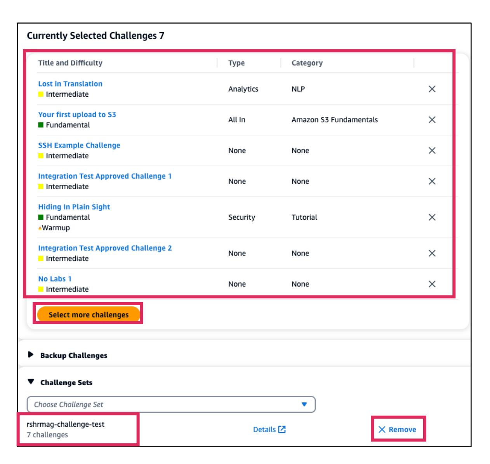

8. You can select challenges from a past event you hosted or participated in by choosing **Previous Events**. In *Search events* select a *Range Start* and *Range End* by entering a date in the format **YYYY/MM/DD** or choose **calendar icon** to pick a date. Then, choose an event in the *Choose Event* dropdown. > **📝 Note:** If no event shows up check the Range Start and Range End dates to make sure the past event falls between your chosen dates.

AWS Jam

9. The past event your selected will populated the *Currently Selected Challenges* with all the challenges from the past event. You can see the past event name you selected. If you don't want to use the previous event, choose **X Remove**.

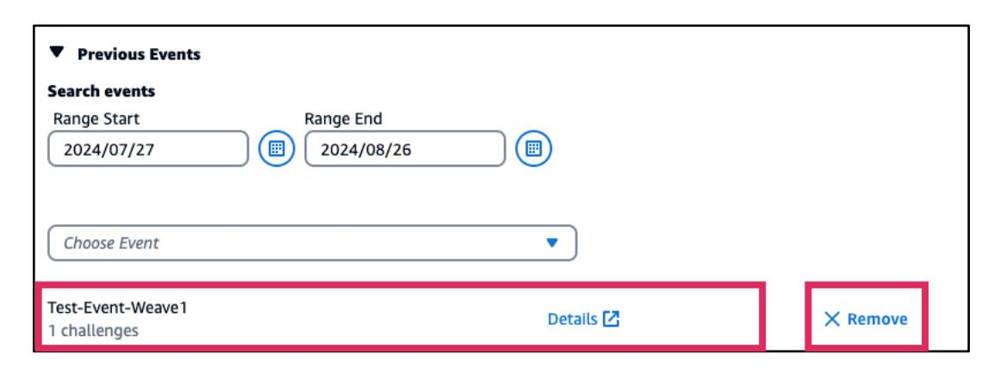

10.When done selecting challenges, choose **Next**.

## *Step 6 Review and Create (How to review event details and create the event)*

1. The Review and Create page displays. This sixth and final step shows the details of all the steps you completed for your review.

2. You can review the details for each step. If there is a setting see that you need to change in a certain category choose **Edit**.

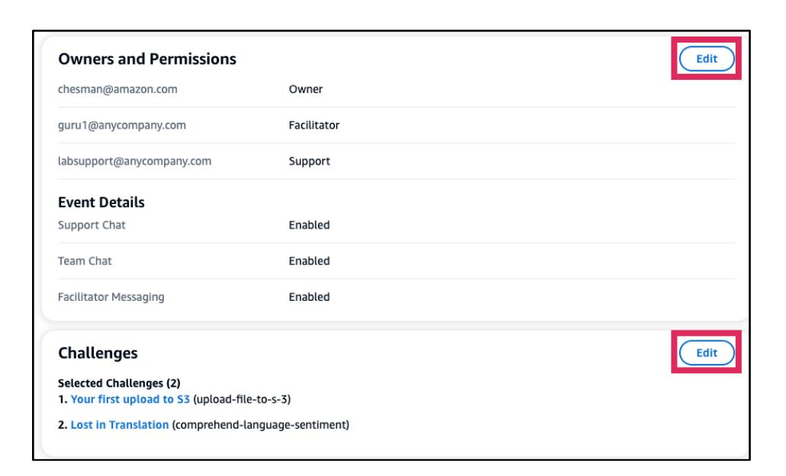

3. When you are done reviewing the all the event steps, choose **Create Event Request**.

4. The event page is shown with important information such as the timeline, access, event overview, team settings, and preparation guide. You can see the event name at the top.

## How to manage existing events

A list of your existing events page displays the name of each event. In the event admin page you can review your settings and make changes as needed.

1. In the Jam landing page navigation, choose **Host**, the choose **Manage your existing events**.

2. A list of your existing events page is shown. You can see the *title*, *channel*, *start date*, *end date*, *max participants*, and *status* of an event(s).

3. You can narrow your search by property, date range, event types, and ended events.

4. Choose **search**, then choose a property from the dropdown without typing anything.

5. You can search by date range. Choose a *Range Start* and *Range End* by entering a date in the format **YYYY/MM/DD** or choose **calendar icon** to pick a date.

6. **Check** the box **Show Ended Events** to show ended events. You will see events with *ENDED Status*.

7. Choose the **column title** to change between **ascending** and **descending** sort order.

8. Choose the **title** of the event you want to manage.

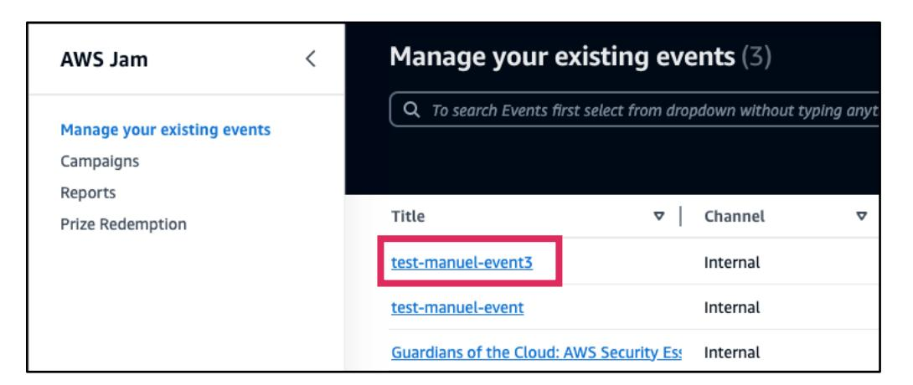

9. The event admin page shows a summary of your event such as timeline, event access, event overview, team settings, and preparation guide.

10.The *Timeline* shows important dates and time about your event.

11.The *Access* panel shows the **event link** that you can share with participants.

*12.*The *Event Overview* panel shows details about the event such as title, start and end times, number of participants, channel, and privacy type.

*13.*The *Team Settings* panel shows information about the team assignment, size, forming start time, and ability to rename teams.

14.The *Preparation Guide* section shows links to **FAQ** pages for the following: *For Event Owners*, *For Facilitators*, and *For Learners*.

- 15.Choose **Actions** on the top right of the page to show the actions you can choose to take for the event:
	- a. **Unlock Challenges**: This option unlocks the challenges when the event starts. > **📝 Note:** A facilitator must unlock the challenges manually if you did not set it to automatically unlock.
	- b. **Book this event again**: This option enables you to create this event again using all the settings and challenges selected in it.
	- c. **Cancel Event**: This option enables you to cancel the event if needed.

16.Choose **Edit**, if you need to make changes to any setting in the *Event Overview* or *Team Settings* panel.

17.On the left menu choose the **Challenges** link to manage your selected challenges.

18.The *Selected Challenges* tab and the *Selected Challenges* page shows the total number of selected challenges next to it. You can see the *Max score* points and how long the event is estimated to take in the *Estimated Time For All Challenges*.

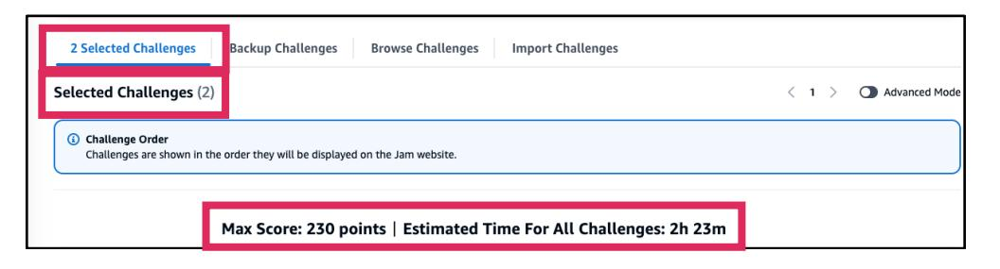

19.You can also see the challenges below that with basic information in each individual challenge.

20.You can see more information about each challenge by choosing to turn **on Advanced Mode** located on the top right side of *Selected Challenges* page title.

21.Advanced Mode shows additional information about a challenge such as *Average Solve Time*, *Last Solved*, *AWS Services*, *Tags*, *Average Deploy Time*, and *Warmup*.

## How to book a past event

You can select challenges from a past event you hosted or participated in for the *Schedule a Custom Jam Event* task.

1. In the Jam landing page navigation, go to **Host**, then select **Create a Custom Jam Event**.
2. Complete all the steps until you get to the *Challenges* step or skip the earlier steps and go directly to the *Challenges* step.

3. Scroll down to the Previous Events panel and choose it. In *Search events* select a *Range Start* and *Range End* by entering a date in the format **YYYY/MM/DD** or choose **calendar icon** to pick a date. Then, choose an event in the *Choose Event* dropdown. > **📝 Note:** If no event shows up check the Range Start and Range End dates to make sure the past event falls between your chosen dates.

4. The past event your selected will populated the *Currently Selected Challenges* with all the challenges from the past event. You can see the past event name you selected. If you don't want to use the previous event, choose **X Remove**.

### How to access your event

1. In the Jam homepage navigation, choose **Host**, the choose **Manage your existing events**.

2. A list of your existing events page displays the name of each event. Choose the **event title** you want to access.

3. The event admin page is displayed.

## How to invite participants to an event

For events that have been configured as *Private invite* for the event privacy type, then you would to invite participants by email. If a participant has not been added to the *Invited Participants* list, they will not be able to enter the event. > **📝 Note:** For events that have been configured as *Private Code* participants can enter events using the *event link* or by entering the *secret key* in **Join an Event** in the Jam homepage navigation **Play** menu.

**IMPORTANT***: A Jam learner must be a Skill Builder Team Subscriber in order to participate in a Jam event.*

1. In the Jam homepage navigation, choose **Host**, the choose **Manage your existing events**.

2. A list of your existing events page displays the name of each event. Choose the **event title** you want to access.

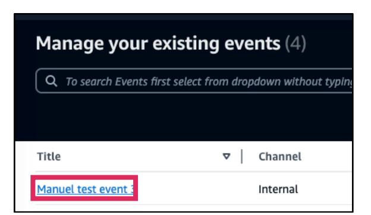

3. The event admin page is displayed. In the event management menu on the left choose **Participant Management**.

*4.* The *Participant Management* page is where you can add participants. In *Add participant email*, type only one *email* at a time, then choose **Add**.

*5.* The email invite list is shown. When done entering emails, choose **send email to (number) participant(s)**.

6. The Save and Send Email Invitation panel is shown confirming the number of added participants. Choose **send email to (number) participant(s)**.

*7.* The *Invited Participants* list is updated with the most recent *participant email(s)* invited.

## How to invite participants to an event using bulk upload

You can invite participants in bulk using a CSV file instead of entering it manually one at a time.

**IMPORTANT***: A Jam learner must be a Skill Builder Team Subscriber in order to participate in a Jam event.*

1. In the Jam homepage navigation, choose **Host**, the choose **Manage your existing events**.

2. A list of your existing events page displays the name of each event. Choose the **event title** you want to access.

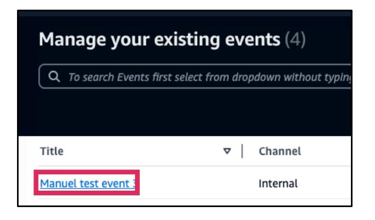

3. The event admin page is displayed. In the event management menu on the left choose **Participant Management**.

4. You can add multiple emails with *Import CSV file*. Choose **Download template** and save the file *InviteParticipantTemplate* somewhere in your computer filesystem.

5. Open the InviteParticipantTemplate.csv file and type in the **emails** of your invitees. **Save** the csv.

*6.* **Choose fle**, locate and **Open** the *csv file.*

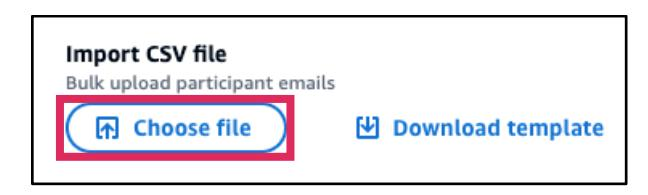

*7.* You will see the *CSV* name, size and date information. Choose **Send Invite For Upload CSV**.

*8.* The *Invited Participants* list is updated with the most recent *participant email(s)* invited.

### How to share the event links

1. In the Jam homepage navigation, choose **Host**, the choose **Manage your existing events**.

2. A list of your existing events page displays the name of each event. Choose the **event title** you want to access.

3. In the event summary navigate to the *Access* panel to find the event link. *Event Link* shows the URLs which grants participants direct access to the live event or testers to the test event. Choose **Copy event link** and share it to your invitees or testers using your choice of method.

The *Secret Key* is displayed if the event was configured as *Private code* for the event privacy type. Copy the secret key and send to participants or testers for so they can enter the event using the "**Join an Event**" in the Jam homepage navigation.

## How to change the number of participants in an event

1. In the Jam homepage navigation, choose **Host**, the choose **Manage your existing events**.

2. A list of your existing events page displays the name of each event. Choose the **title** of your existing event.

3. In the event page select **Edit**, on the top right of the page.

4. In *Event Overview*, go to *Number of participants* and change the **number** in **Minimum participants** and **Number of participants** as needed.

5. When done, choose **Save**, on the top right of the page.

### How to change the time and date of an event

1. In the Jam homepage navigation, choose **Host**, the choose **Manage your existing events**.

2. A list of your existing events page displays the name of each event. Choose the **title** of your existing event.

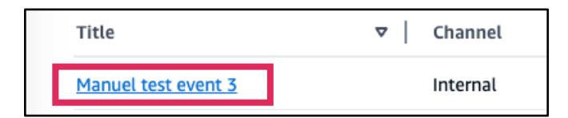

3. In the event page select **Edit**, on the top right of the page.

4. In *Event Overview* panel, go to **Start Time** and change the **date** and **start time**.

5. When done, choose **Save**, on the top right of the page.

### How to test a Jam event

1. In the Jam homepage navigation, choose **Host**, then **Manage your existing events**.

2. A list of your existing events page displays the name of each event. Choose the **event title** of your existing event to open the event admin page.

3. Go to the *Access* panel to see the test *event link*. The Event Link shows the event link of the Test Event. If there is no link, choose **Create Test Event**.

4. A test event link will be made and will display. Choose the **test event link** to open the test event in a new browser tab or window. Choose **Copy secret key** to send to testers. You can see the *Test Labs Active* status color below the *Copy secret key* pill. > **📝 Note:** A tester must be invited by the event owner to access the test event.

### How to know more about a challenge

1. In the Jam homepage navigation, choose **Host**, the choose **Manage your existing events**.

2. A list of your existing events page displays the name of each event. Choose the **event title** of your existing event to open the event admin page.

3. At the Challenges step browse for challenges. For any challenge you want to know more about choose the **challenge title**.

4. The challenge information panel will display on the right side. You can know more about the rating, difficulty, description architecture, and more.

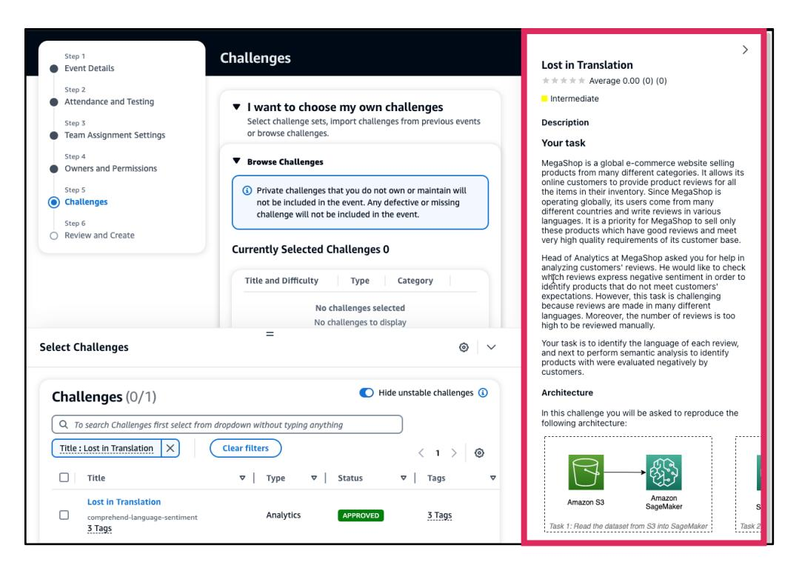

5. To see the challenge details in a larger view scroll down on the challenge information panel and choose **Go to Challenge Details**.

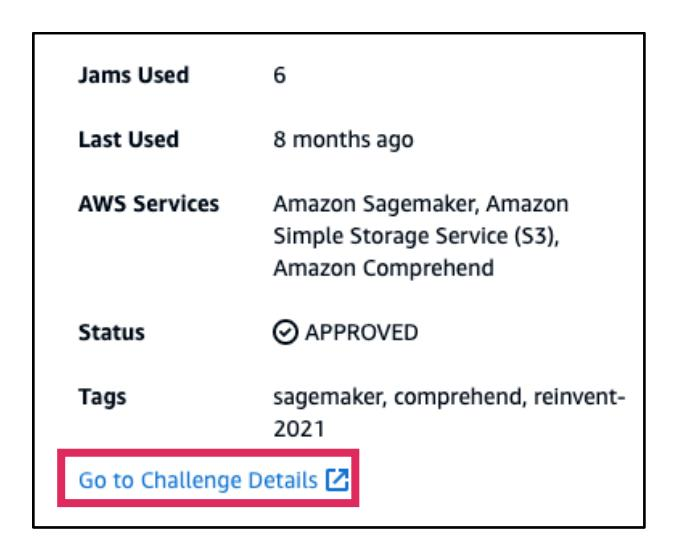

6. The *challenge details* page opens in a new browser window. You can see additional details about the challenge in a larger view browser window.

---