# Facilitators Guide

This section covers how to use the facilitator features for a Jam event. An event owner should have given the facilitator role to the same account to which you are logging in to Jam. Ask the event owner if they have added your email as a facilitator. > **📝 Note:** An event owner has the facilitator role by default.

### How to use the Participants page

The Participants page is where you manage teams and participants. Here, you can manage team names, reset a team's password, manage the team members, and remove a participant from the event.

- **1. Access your event using the event link.
2. In the event page you will see the challenge navigation menu on the left. Choose the **Facilitator**, then **Participants**.

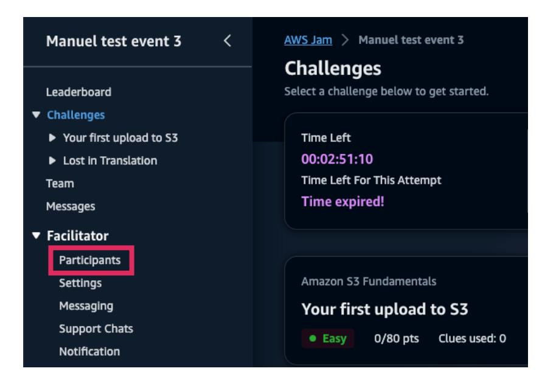

3. You will see the *Participants* page. The participants page gives you an overview of the number of *teams*, *participants*, and *facilitators*.

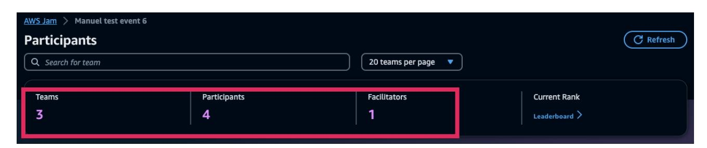

4. In the *Teams* section you can see individual users for teams by choosing the **expand** button located to the left of the *team names*.

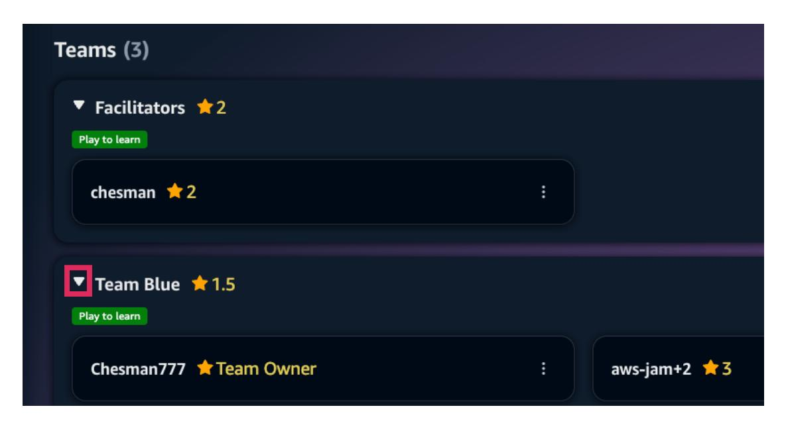

5. You can see the goals for each team with a label below the team name, which is one of the following**: *Play to learn* or *Play to win*.

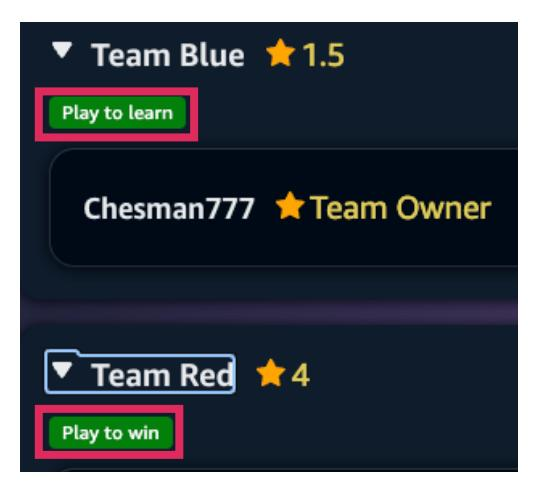

6. You can see who is the *Team Owner*. You can see the skill level of a team and individual users by the level icon (star with number) next to the user names. > **📝 Note:** A skill level of 0 will not show the number. The team skill level is determined by taking the average skill level for all the team members.

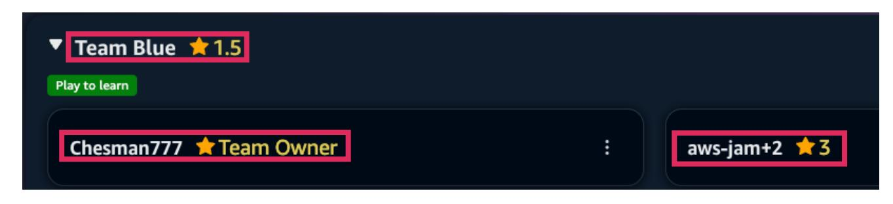

7. You can take the following actions for an individual team by choosing **Actions**, the choosing one of the following options:
	- a. **Change team name**: Change a team's name for any reason.
	- b. **Lock team name**: Lock the team name to prevent it from being changed by the team owner.
	- c. **Change team password**: Change a team password for any reason.
	- d. **Remove team password**: Remove a team password so anybody can join the team without having to enter a password.

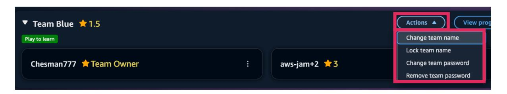

8. Choose **View progress** in the team panel to view a team's progress. You can see the team's progress for each challenge. For a challenge you can see what time it was started (*Start Time*), how many tasks were finished (*Completed*), and how many restarts were used (*Restart Used*).

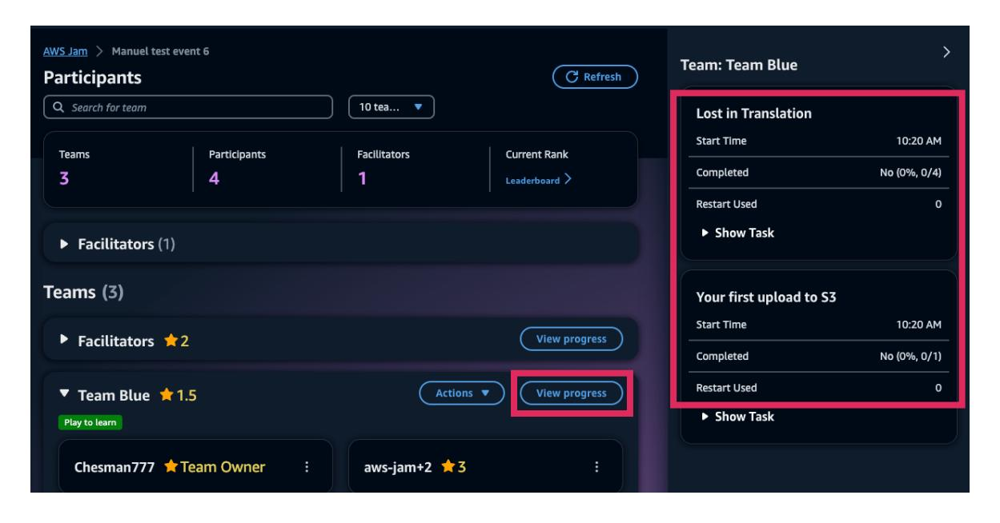

9. You can see a team's progress for each task of an individual challenge. Choose **Show Task** to show the progress report for all the tasks. You can see if it has been completed (*Completed*), how many clues were used (*Used Clues*), and the answers submitted (*Submitted Answers*). When done you can choose **Show Task** to close the progress report.

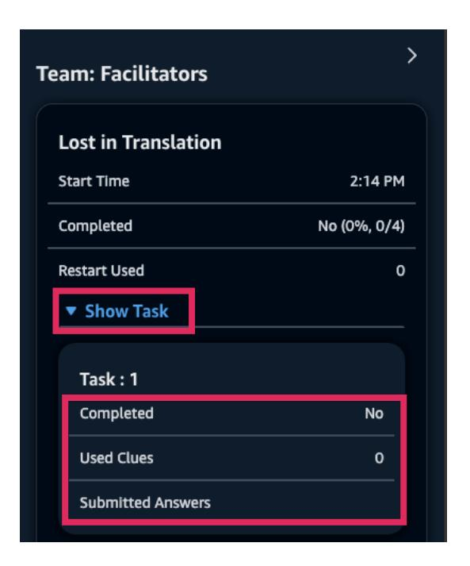

- 10.You can take actions on individual users. Choose the **kebab (three dots menu)**, then pick one of the following options:
	- a. **Change team**: Move a participant to another team. You may do this to balance out a team's skill level compared to the rest of the teams.
	- b. **Remove from team**: Remove a participant from the team. You may remove the participant for inactivity or for any other reason.
	- c. **Make team owner**: Make a participant the team owner. You may want to do this if the current team owner is inactive and someone else volunteers to be the team owner.

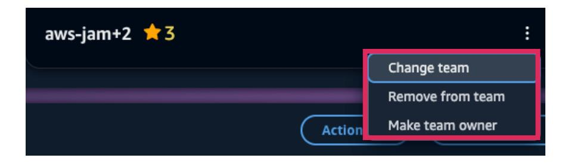

### How to move a participant to another team

1. Access your event with the event link or secret key.
2. In the event page you will see the **Facilitator** menu on the left. In the **Facilitator** menu, choose **Participants**.

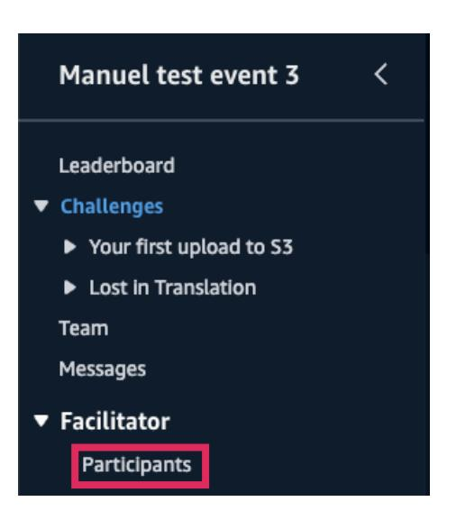

3. Go to the *Teams* section. Then choose the **expand** button located to the left of the team name of the participant you want to move.

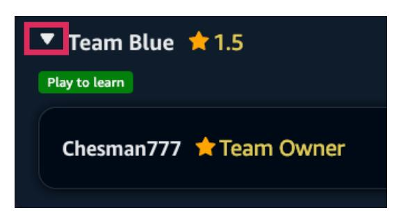

4. Locate the participant you want to move. In the username panel choose **kebab (three dot menu)**, then **Change team**.

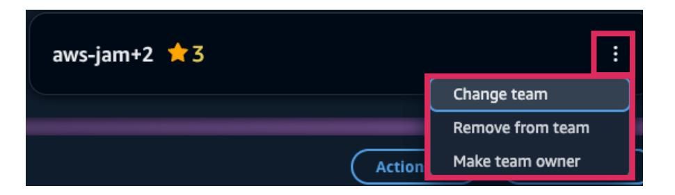

5. Choose **Select a team** dropdown, the choose a different **team** than the one the participant belongs to. Then choose **Submit**.

6. The participant will be moved to the new team.

### How to remove a participant

1. Access your event with the event link or secret key.
2. In the event page you will see the **Facilitator** menu on the left. In the **Facilitator** menu, choose **Participants**.

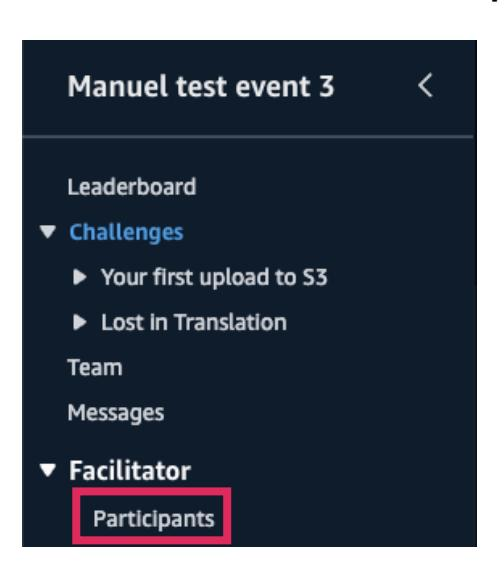

3. Go to the *Teams* section, then choose the **expand** button located on the left of the team name of the participant you want to move.

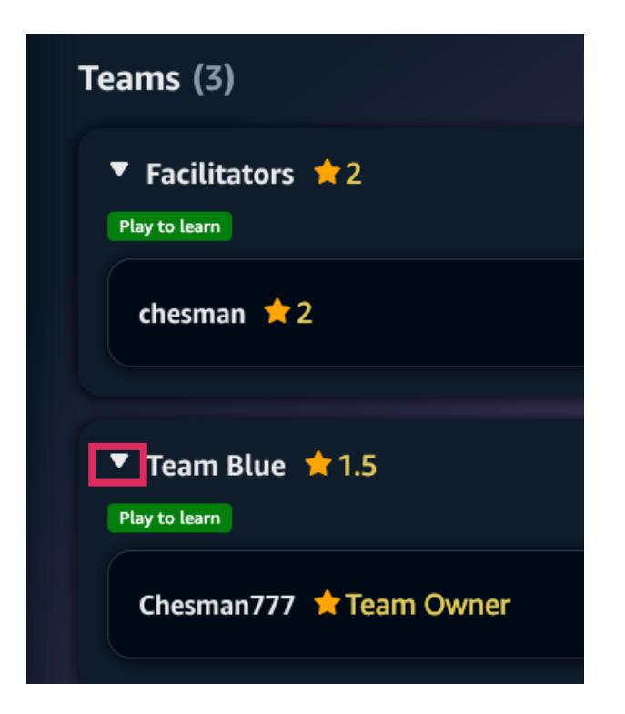

4. Find the participant you want to move. Choose the **kebab (three dot menu)** in their username panel, then **Remove from team**.

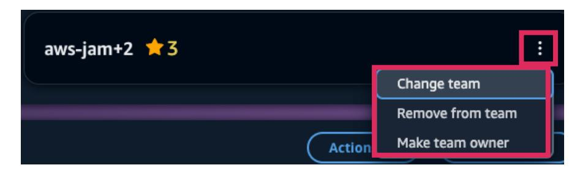

5. In the *Please enter removal reason panel* choose one of the following reasons from the **dropdown**:
	- a. **Choose Removing for other reasons**
	- b. **Removing user due to reported inactivity**

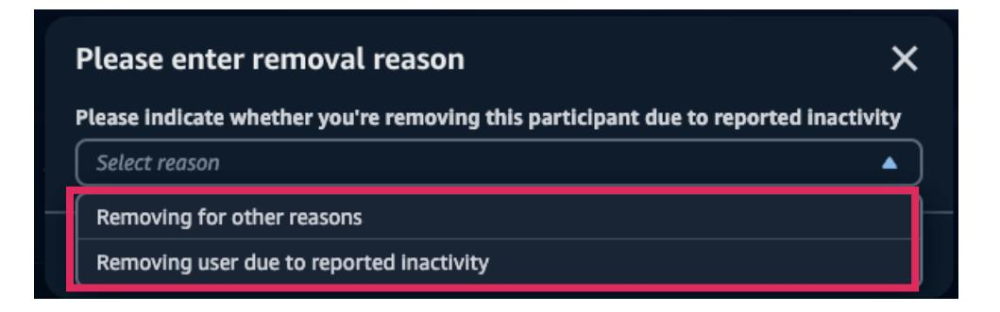

6. When done choose **Submit**.
7. The participant will be removed from the team.

### How to use Settings

You can get to the settings page from the *Facilitator* menu in the *event admin page*. The settings page is where you can adjust the settings for the challenges, scoring, and chat.

1. In the event admin page, choose **Facilitator**, then **Settings**. > **📝 Note:** If you are a facilitator and you cannot see the Facilitator menu, ask an event owner to give you *facilitator* permissions. Then logout of Jam and log back in.

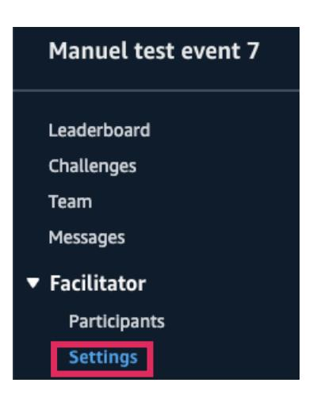

2. The Settings shows the following panels:
	- *a. Jam Status*: This shows the status of the Jam and whether challenges are available. In *warmup mode* only warmup challenges are unlocked.
	- b. *Scoring Deadline*: This shows the date and time scoring will be locked.
	- *c. Support Chat*: This shows if support is enabled or not.
	- *d. Challenge Expiration*: This show the date and time when challenges will expire. Challenges remain available even if scoring is finalized.

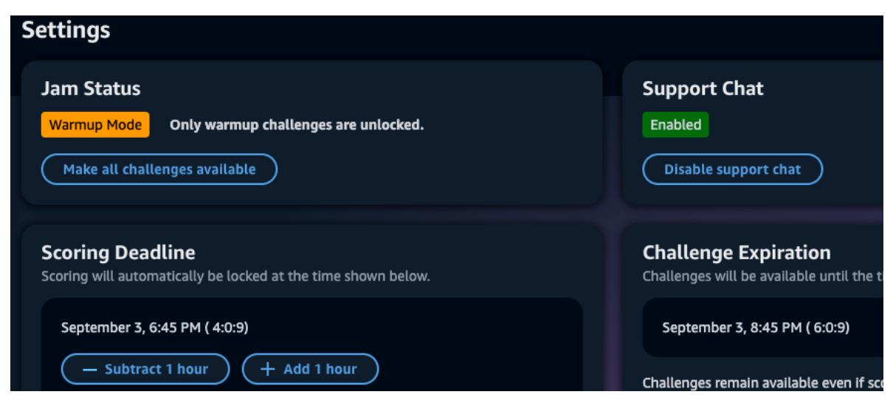

### How to use unlock challenges

If your event has begun and the challenges are not available, they will need to be unlocked for participants to work on them. You need to be an event owner or facilitator to unlock challenges.

1. In the event admin page, choose **Facilitator** menu, then **Settings**. > **📝 Note:** If you are a facilitator and cannot see the **Facilitator** menu, ask an event owner to give you *facilitator* permissions. Then logout of Jam, then log back in.

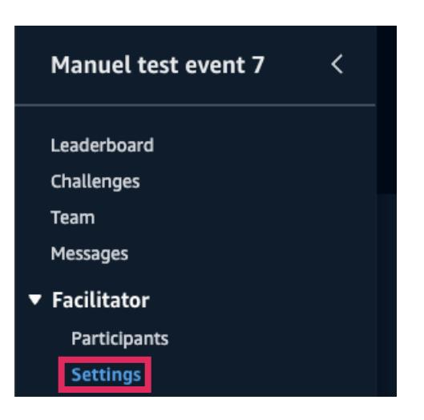

2. In the Settings page navigate to the *Jam Status* panel. Choose **Make all challenges available**.

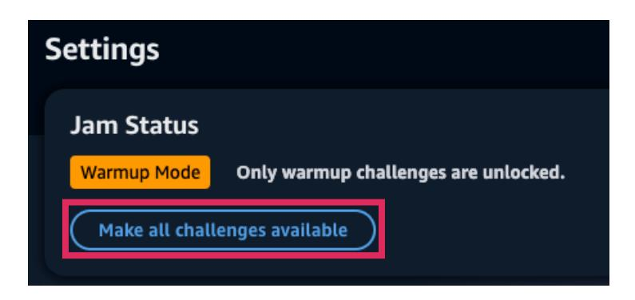

3. All challenges are now available.

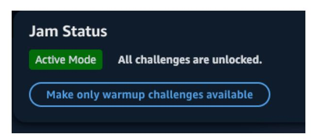

## How to see the challenge expiration

1. In the event admin page, choose **Facilitator**, then **Settings**. > **📝 Note:** If you are a facilitator and cannot see the **Facilitator** menu, ask an event owner to give you *facilitator* permissions. The log out of Jam, then log back in.

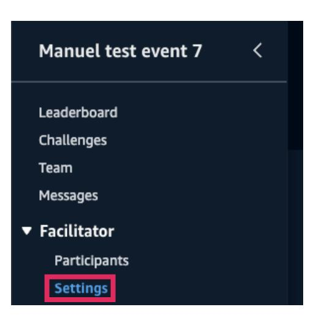

2. In the Settings page navigate to the *Challenge Expiration* panel. You can see the date and time of the challenge expiration. > **📝 Note:** Challenges remain available even if scoring is finalized.

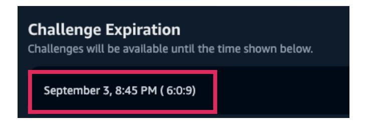

## How to use Messaging Tab

The Messaging page is used to send messages to or email event participants.

1. In the event admin page, choose **Facilitator**, then **Messaging**. > **📝 Note:** If you are a facilitator and cannot see the **Facilitator** menu, ask an event owner to give you *facilitator* permissions. The log out of Jam, then log back in.

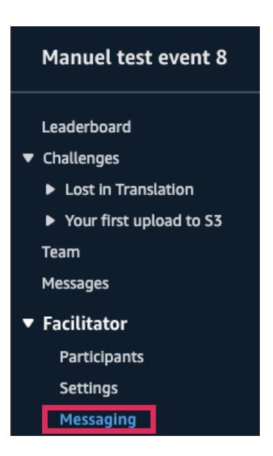

2. The messaging page is where you can send messages and emails to all recipients, a team, or a single participant.

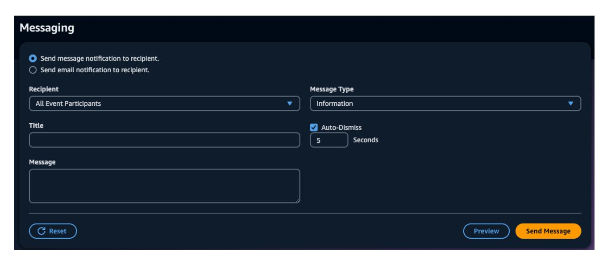

3. You can send a message to different type of recipients. In *Recipient* choose **dropdown** and one of the following options:
	- a. **All Event Participants**: The default is to send a message to all event participants.
	- b. **A Specific Team**: Send a message to specific team.
	- c. **A Specific User**: Send a message to a specific user.

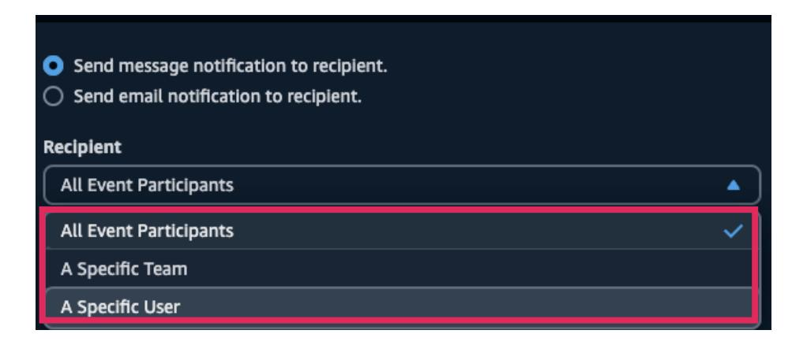

4. You can send two types of messages, which is one of the following:
	- a. **Information**: This type is used to send information such as the names of the lab helpers in the room.
	- b. **Warning**: This type is used for when the event is about to end.

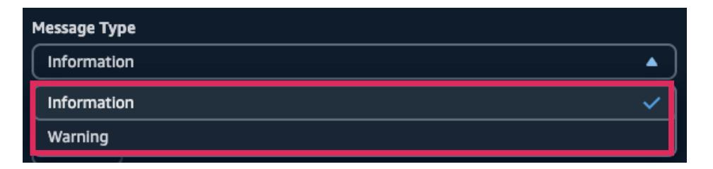

5. The **Auto-Dismiss** is enabled by default. It is used when sending a notification. The notification will automatically clear after the number of **seconds** entered.

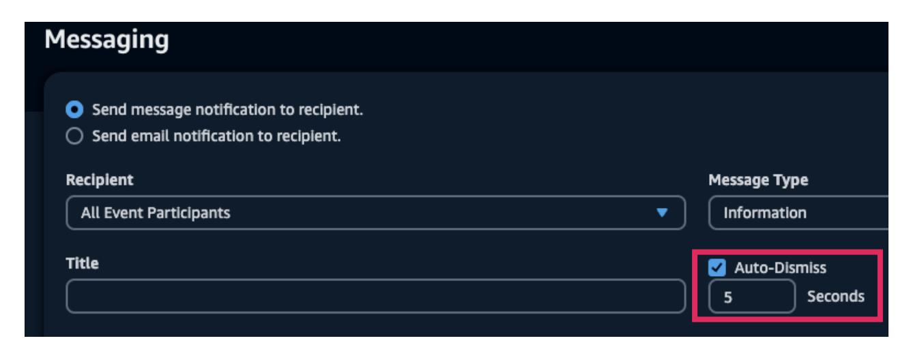

6. Choose **Preview**, after composing a message to see how it would look to recipients.

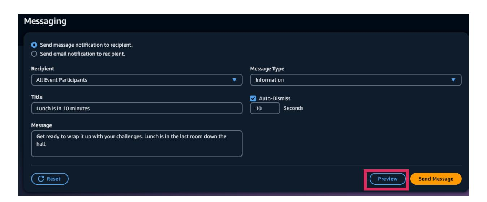

7. The notification preview is shown in a banner at the top of the page.

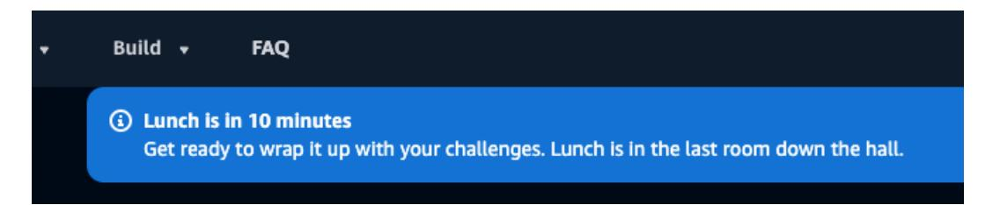

8. When you are satisfied with message and settings choose **Send Message.**

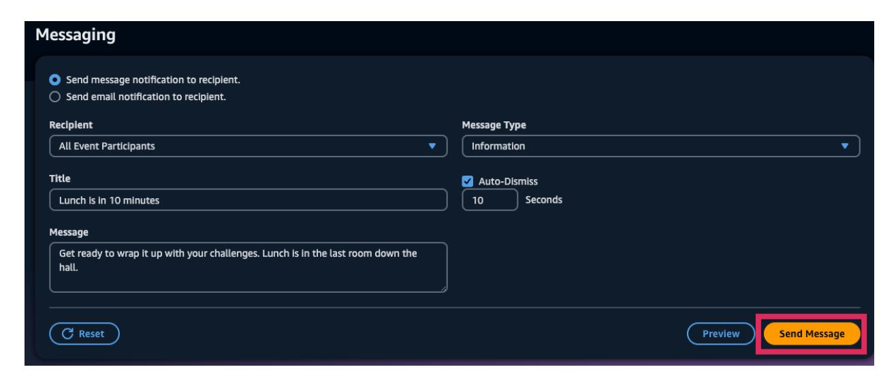

### How to use Chat

You can chat with facilitators team members during the live event.

1. In all of the event pages, on the bottom right, choose **Team Chat**.

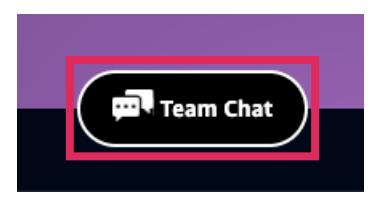

2. Type your message, then choose **Send**.

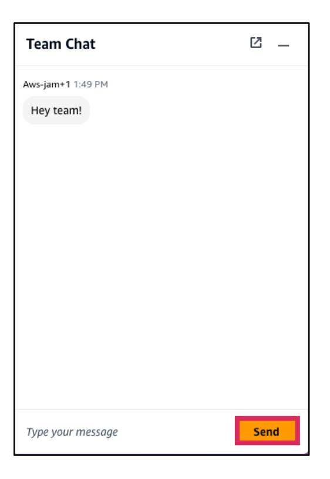

3. Choose **open in a new browser ( )** icon, to open the chat window in a new browser tab.

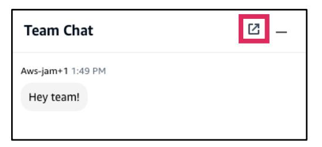

4. Choose **minimize** ( \_ ) icon, to hide the chat window and end the conversation with the team.

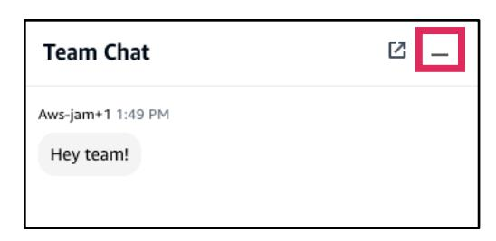

## How to Chat with Participants

When the *support chat* option is enabled while scheduling a custom event, a dedicated support member can chat with a participant needing help. > **📝 Note:** The *support chat* option is enabled during the *Owners and Permissions* step in the *Support and Collaboration* panel. The *support chat* option should be enabled only if there is someone dedicated to monitoring the support chat queue.

1. When a participants requests chat support, a support team member will see the **Support Chat** window popup at the bottom right of the page.

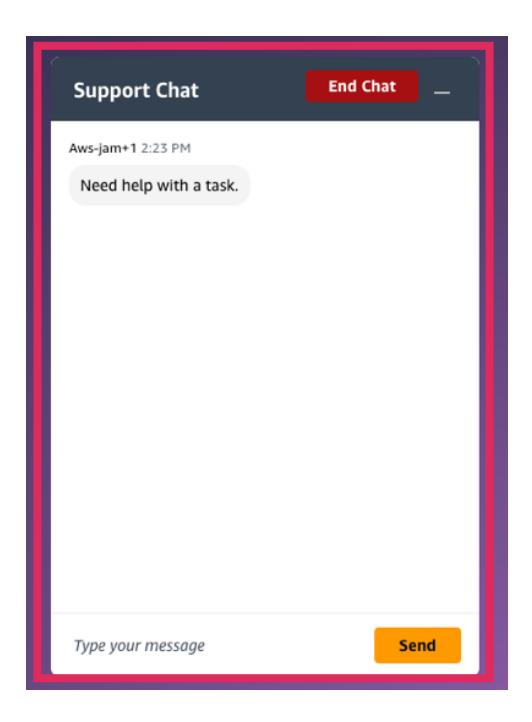

The support team member and all other members in the facilitators team will see a number in the support chat button on the bottom right of the page indicating how many support requests are in the queue.

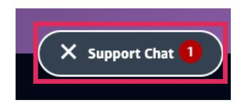

2. The **Support Chats** menu item shows how many support chats are in the queue. Choose **Facilitator**, then **Support Chats (***number***)** to open the queue.

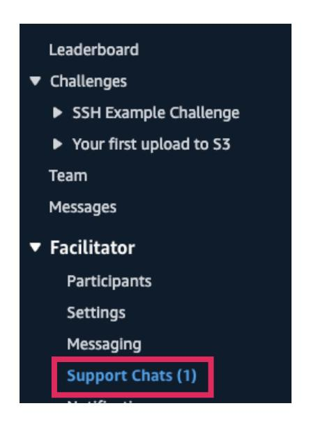

3. The Support Chat Queue shows information about the chat requests in the queue such as time requested, user, and team. Choose **New – begin chat** to start the conversation with the participant.

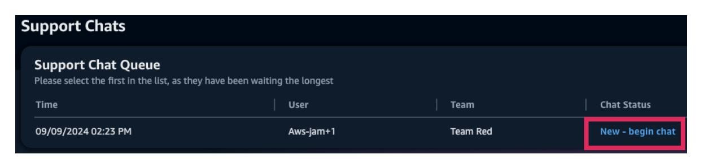

4. The **support chat** window displays on the bottom right of the page. You can see the user you are chatting with on the top of the chat window and also in the chat window. Type your message in the *Type your message* field and then **Send**. Choose **Team Info** to see more info about the team in a new browser window. Choose **minimize** to hide the Support Chat window. When done conversing, choose **End Chat**.

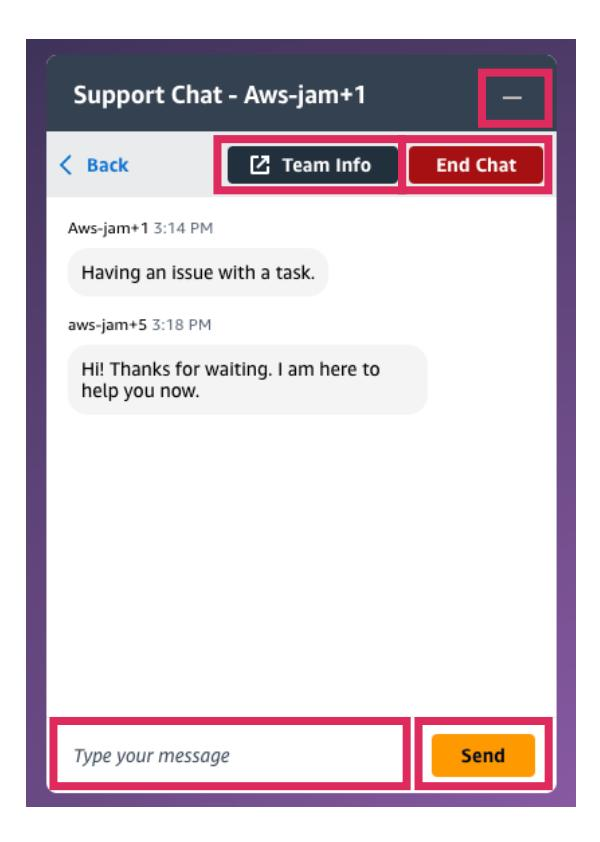

---