# イベントの作成

--8<-- "source-notice-ja.md"

## カスタムJamイベントをスケジュールする方法

特定のチャレンジを選択して独自のユニークなJamイベントを作成したい場合、カスタムJamイベントをスケジュールします。このプロセスには6つのステップがあります：*イベント詳細*、*出席とテスト*、*チーム割り当て設定*、*所有者と権限*、*チャレンジ*、*確認と作成*。

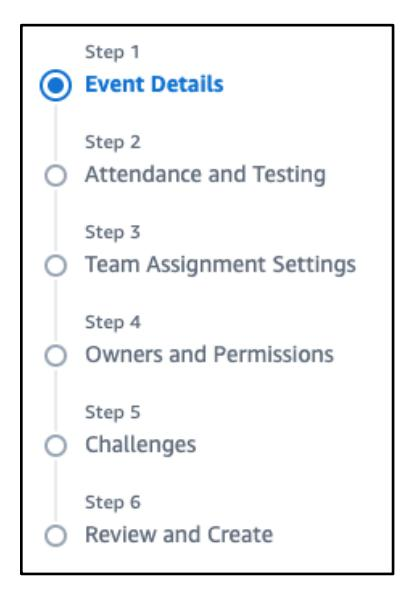

1. Jamランディングページのナビゲーションで、**Host**を選択し、次に**Schedule a Custom Jam Event**を選択します。

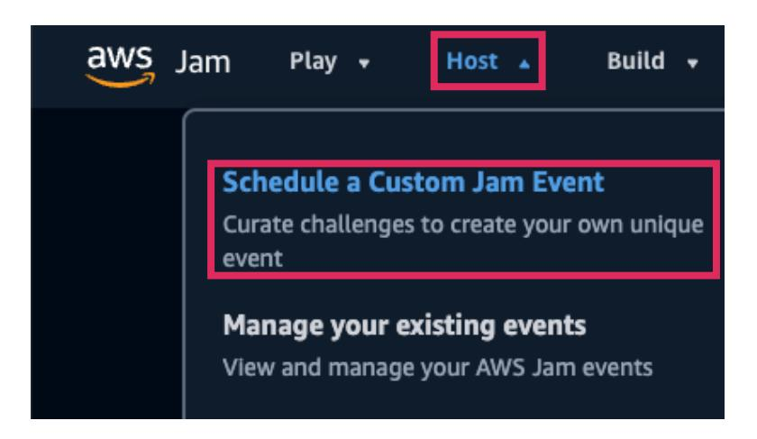

## *ステップ1 イベント詳細（イベント日時の入力方法）*

*イベント詳細*ページが表示されます。カスタムJamイベントをスケジュールする最初のステップは、基本的な詳細を完成させることです。タイトル、イベントの対象者、学習者がイベントにアクセスする方法、イベント時間などの基本情報を設定します。

1. *イベント概要*パネルで、以下を完成させます：
	- a. **イベントタイトル**: イベントのタイトルを4文字から250文字の間で入力します。
	- b. **チャンネル**: イベントの対象者として以下のいずれかを選択します。
		- i. **Skill Builderイベント** アクティブなSkill Builder Team Subscriptionを持つ顧客のみが利用できるイベント。
		- ii. **AWS Classroom Builder Labs** インストラクター主導トレーニングの一部として顧客のみが利用できるイベント。
		- iii. **Internal** Amazonianのみが利用できるイベント。
		- iv. **Public** 一般公開されたイベント。
		- v. **Global Partners** グローバルパートナーが利用できるイベント。
		- vi. **AWS Education** AWS教育プログラム専用のイベント。
		- vii. **Recruiting** AWSでの内部採用に使用されるイベント。

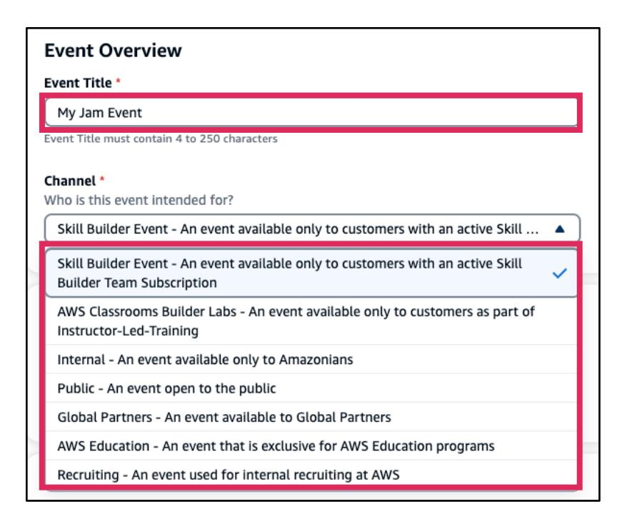

2. *イベントプライバシータイプ*パネルで、以下のいずれかを選択します：
	- a. **Public** すべての学習者に開放されたパブリックイベントを開催します。アクセス制御はありません。
	- b. **Private code** 学習者がイベントにアクセスするためのイベント秘密キーを設定します。
	- c. **Private invite** 学習者がイベントにアクセスするために*参加者管理*でメールを提供します。

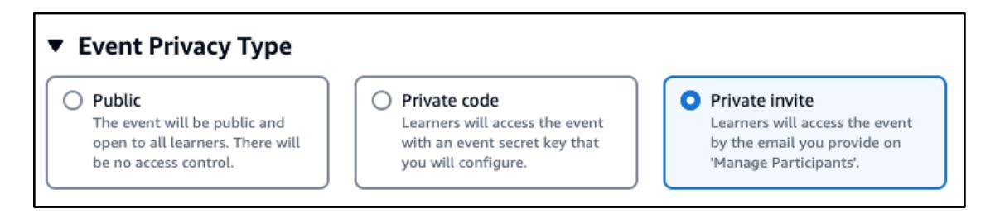

3. *イベント時間*パネルで、以下を完成させます：
	- a. **タイムゾーン**: イベントが開催される場所のタイムゾーンを選択します。
	- b. **開始時間**: **YYYY/MM/DD**形式で開始日を入力するか、**カレンダーアイコン**を選択して日付を選択します。次に、**hh:mm**形式で開始時間を入力し、**AM**または**PM**を選択します。
	- c. **期間**: **4時間**、**8時間**、または**特定**から選択します。
	> **📝 注記:** 8時間を超える期間は手動承認が必要です。このスケジュールの場合は、承認の遅延を予測して数週間前にイベントをスケジュールしてください。
	- d. **重要**（オプション）**チャレンジを自動的にアンロック**: デフォルトでは、ファシリテーターがイベント中に手動でチャレンジをアンロックする必要があります。この機能を有効にすることで、チャレンジを自動的にアンロックできます。ボックスを**チェック**し、イベント開始後にチャレンジが自動的にアンロックされるまでの**分数**を入力します。
	> **📝 注記:** 0分は、イベント開始時間にチャレンジを自動的にアンロックします。

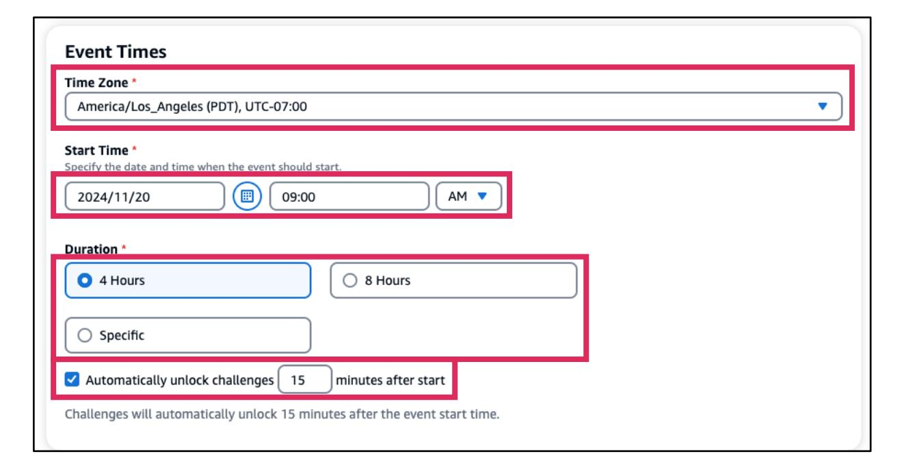

4. （**オプション**）*注記*パネルで、あなたとファシリテーターがイベントで知っておく必要がある**詳細**を入力します。参加者は注記を見ることができません。

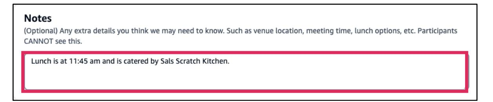

5. イベント詳細の入力が完了したら、**Next**を選択します。

## *ステップ2 出席とテスト（参加者数とチームサイズの設定方法）*

*出席とテスト*ページが表示されます。この2番目のステップでは、推定参加者数とチームサイズを設定します。推定は可能な限り正確である必要があります。また、これがライブイベントかテストイベントかを選択する場所でもあります。

**重要**: *Jam学習者がJamイベントに参加するには、Skill Builder Team Subscriberである必要があります。*

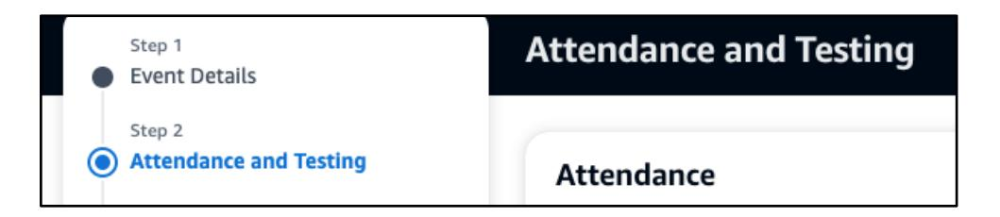

1. *出席*パネルで以下を完成させます：
	- a. **予想参加者数**: 予想する最少**参加者数**と最多**参加者数**を入力します。
	> **📝 注記:** 100人を超える参加者数は手動承認が必要です。
	- b. **チームサイズ**: チームあたりの参加者数を入力します。
	> **📝 注記:** サイズ制限を3〜6人の間に保ってください。制限外のものはイベントの承認を遅らせる可能性があります。

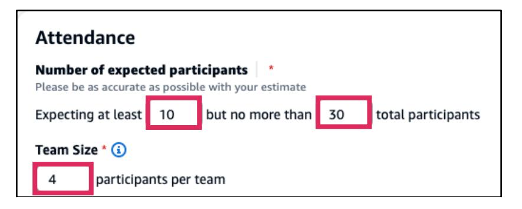

2. *イベントタイプ*パネルで、以下のタイプのいずれかを選択します：
	- a. **ライブイベント**: 参加者がチャレンジを完了するライブイベントの場合、これを選択します。ライブイベントに対してテストイベントが利用可能になります。
	- b. **テストイベント**: チャレンジをテストするためだけにイベントを実行したい場合、これを選択します。（オプション）*特定のユーザーのみにアクセスを許可*を**チェック**してこの機能を有効にします。*所有者と権限*で許可する人を選択できます。

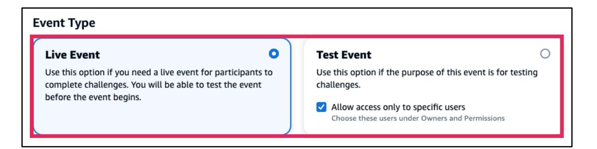

3. 出席とテストの詳細が完了したら、**Next**を選択します。

## *ステップ3 チーム割り当て設定（チーム設定の構成方法）*

*チーム割り当て設定*ページが表示されます。この3番目のステップでは、チームの形成方法、チームサイズ、チームを形成できる時期、チーム名の変更を許可するかどうかを設定します。

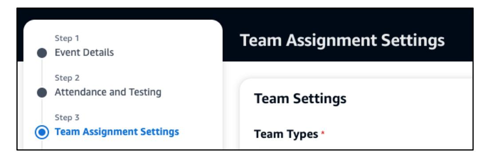

1. *チーム割り当て設定*パネルで**チームタイプ**のいずれかを選択します：
	- a. **自己形成（デフォルト）**: このオプションは、参加者の自己申告スキルレベルと勝利のためのプレイまたは学習のためのプレイの目標に基づいて、システムが提案するチームを参加者に提示します。参加者は新しいチームを作成したり、仲間とパスワード保護されたチームを作成して参加したりするオプションもあります。
	- b. **スキルベース**: 参加者は自己申告スキルレベルに基づいてチームにグループ化され、チームを選択または作成することはできません。イベントファシリテーターがチーム割り当てを開始し、類似または多様なスキルレベルでチームを構成する必要があります。
	- c. **事前作成**: 参加者に特定のチームに参加するよう指示する場合に、このオプションを使用します。参加者は新しいチームを作成できないため、イベント主催者は事前にこのページの参加者セクションからチームを作成する必要があります。
	> **📝 注記:** これは、このイベントが承認された後まで実行できません。

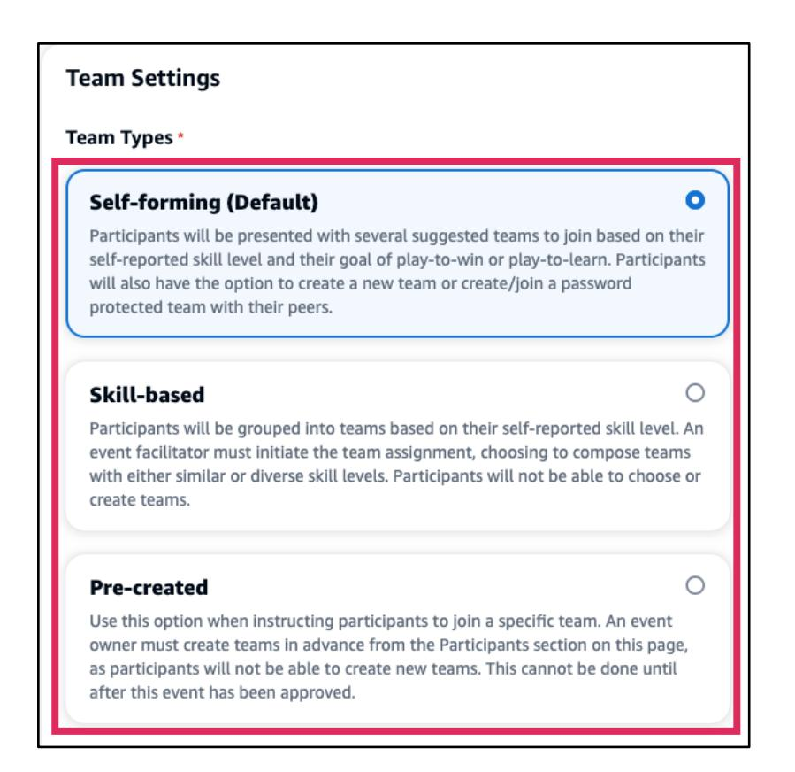

2. *チームサイズ*でチームあたりの参加者数を入力します。
> **📝 注記:** サイズ制限を3〜6人の間に保ってください。制限外のものはイベントの承認を遅らせる可能性があります。

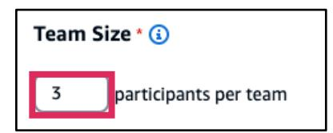

3. *チーム形成開始時間*設定は、チームに参加してからイベント開始時に戻ることを忘れる参加者の数を減らすのに役立ちます。**チームが形成できない時間**で、イベント開始時間前の**分数**を入力します。

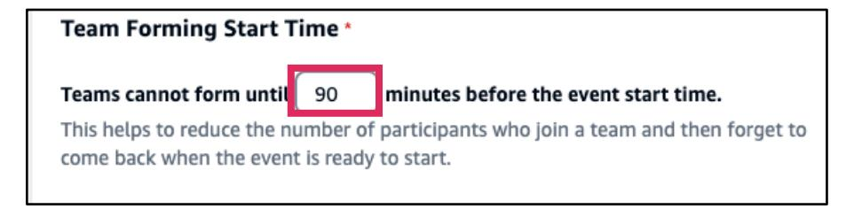

4. *チーム名*設定は、チーム所有者がイベント中いつでもチーム名を編集する能力を制御し、チーム所有者にのみ適用されます。ファシリテーターは常にチーム名を編集できます。チーム所有者によるチーム名の変更を有効にするには、**チーム所有者にチーム名変更を許可**を**チェック**します。

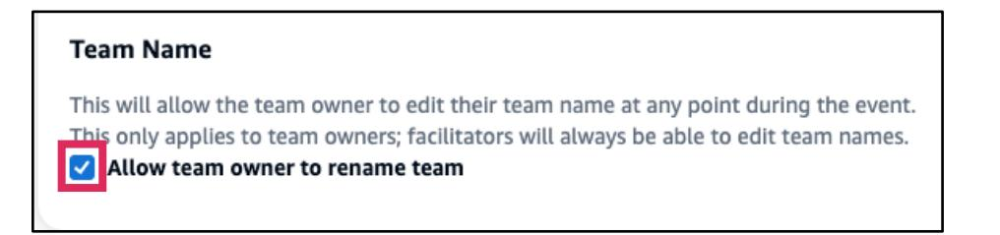

5. *チーム割り当て設定*が完了したら、**Next**を選択します。

## *ステップ4 所有者と権限（所有者と権限の追加方法）*

*所有者と権限*ページが表示されます。この4番目のステップでは、イベントチームメンバーを追加し、権限を設定できます。また、ファシリテーターと参加者間のメッセージング、チャットサポート、チームメンバーチャットと会議の作成を有効にする場所でもあります。

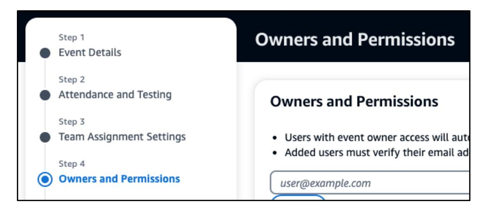

1. *所有者と権限*パネルは、イベントチームメンバーを追加し、権限を管理するために使用されます。入力フィールドに、イベントに追加したいユーザーの**メールアドレス**を入力し、**Add**を選択します。追加されたユーザーは、イベントに参加する前にメールアドレスを検証するためのメールを受信します。

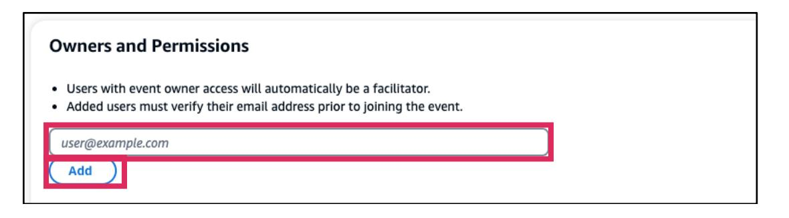

2. *権限*セクションには、イベントに追加したすべてのイベントチームメンバーとその権限が表示されます。メンバーの権限を選択するには、そのメールと同じ行にある役割を**オン**に切り替えます。ユーザーを削除するには、ユーザーの**行**で**X**を選択します。
> **📝 注記:** 元のイベント所有者はデフォルトで3つすべての役割を持ち、削除できません。メンバーごとに1つの役割のみを選択できます。権限の順序は最高から最低まで：*イベント所有者*、*ファシリテーター*、*サポート*です。役割を選択すると、ユーザーはそれより下のすべての権限も取得します。たとえば、*ファシリテーター*を選択すると、そのメンバーは*サポート*権限も取得します。

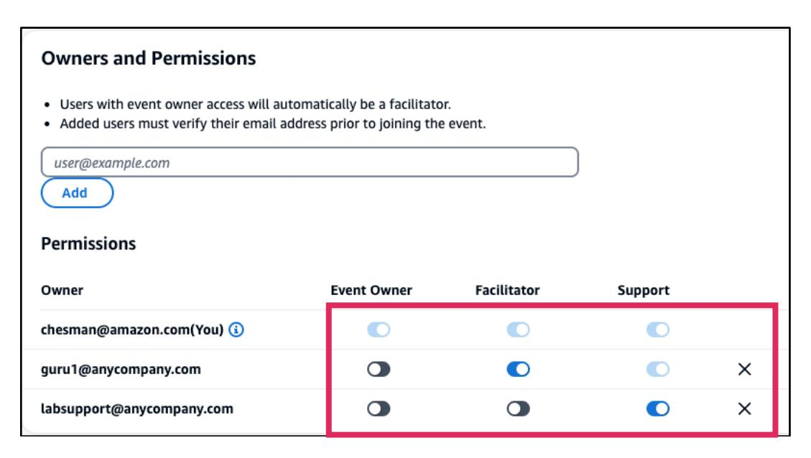

3. *サポートとコラボレーション*セクションでは、チャットと会議を使用したサポートとチームコラボレーションを有効にします。イベント要件に基づいて以下を有効/無効にできます：
	- a. **サポートチャット**: このオプションはデフォルトで無効になっています。このオプションが有効になっている場合、参加者はサポートメンバーとのチャットを要求できます。
	> **📝 注記:** バーチャルイベントの場合、チャットサポートオプションを有効にすることをお勧めします。これにより、ファシリテーターがバーチャルでサポートを提供できます。サポートチャットキューの監視専用のイベントチームメンバーがいる場合にのみ、このオプションを有効にしてください。
	- b. **チームチャット**: このオプションはデフォルトで有効になっています。このオプションが無効になっている場合、参加者はイベントのためにチームとのチャット/会議を開始できません。
	- c. **ファシリテーターメッセージング**: このオプションはデフォルトで有効になっています。このオプションが無効になっている場合、ファシリテーターはイベントのチームや参加者にメッセージを送信できません。

4. *所有者と権限*設定が完了したら、**Next**を選択します。

## *ステップ5 チャレンジ（イベントにチャレンジを追加する方法）*

*チャレンジ*ページが表示されます。この5番目のステップでは、参加者が解決するチャレンジを選択します。個別に選択したり、キュレートされたチャレンジセットを使用したり、過去のイベントのチャレンジを使用したりできます。

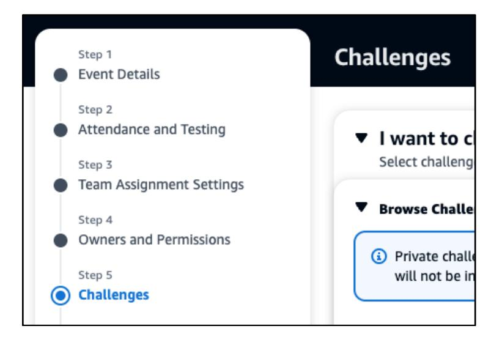

1. *チャレンジ*ページで、**自分でチャレンジを選択したい**パネルが最大化され、**チャレンジを閲覧**パネルも最大化されています。**チャレンジを選択**を選択して、チャレンジライブラリを閲覧し、イベントで使用するチャレンジを選択します。

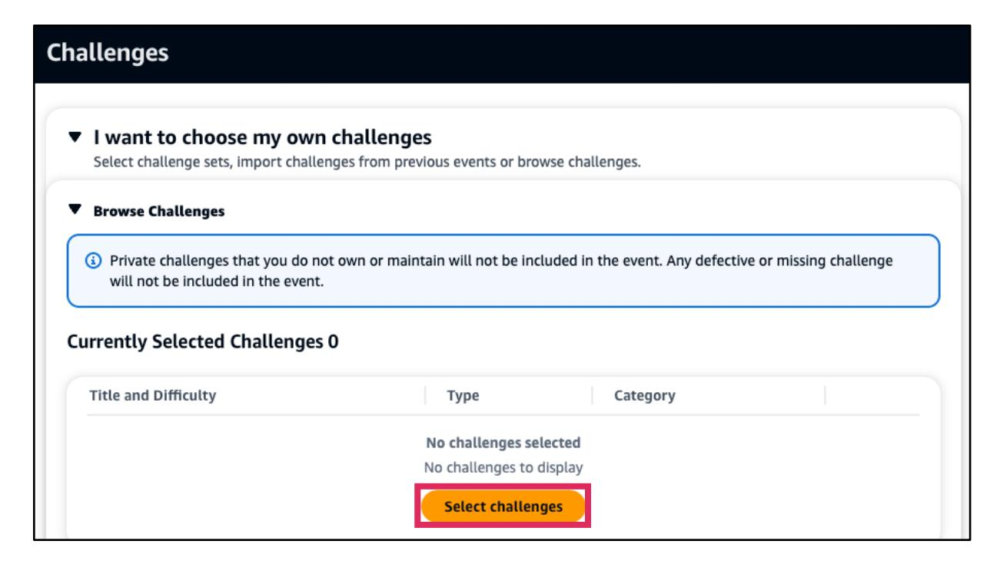

2. *チャレンジを選択*パネルにはチャレンジライブラリが表示されます。*チャレンジ*タイトルの右側には、下記のリストから選択できる利用可能なチャレンジのうち、選択したチャレンジの数が表示されます。数はフィルターに基づいて変化します。**不安定なチャレンジを非表示**はデフォルトで有効になっています。このオプションを**オン**/**オフ**に**切り替えて**、不安定なチャレンジを非表示/表示できます。

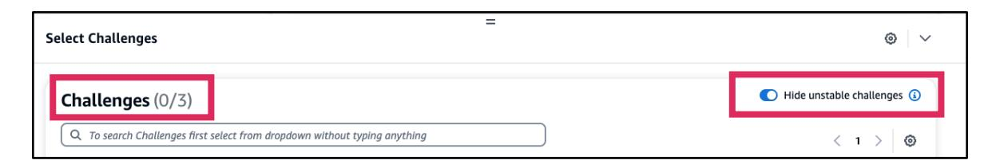

3. 何も入力せずに*検索*フィールドを選択すると、*プロパティ*パネルが表示されます。プロパティに基づいてチャレンジをフィルタリングできます。利用可能なプロパティは次のとおりです：**タイトル**、**ステータス**、**所有者**、**カテゴリ**、**難易度**、**AWSサービス**、**タグ**。

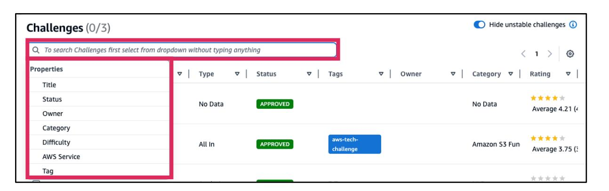

4. プロパティを選択すると、より具体的なチャレンジを見つけるために使用される*オペレーター*が表示されます。次の2つの演算子から選択できます：
	- a. `**=**` **等しい**。この演算子は、チャレンジプロパティで入力したとおりのテキスト文字列を正確に見つけるために使用されます。
	- b. `**:**` **含む**。この演算子は、チャレンジプロパティ内のどこかに見つかるテキスト文字列を見つけるために使用されます。

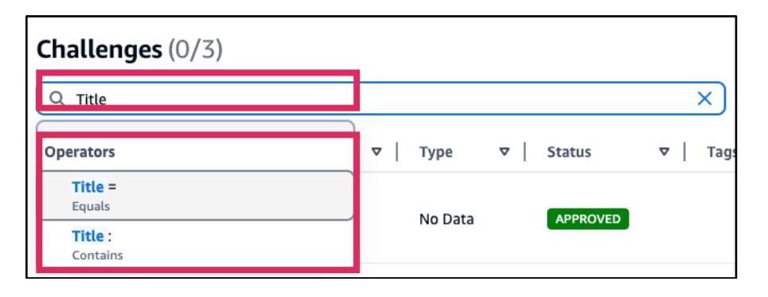

演算子の後にテキストを入力すると、利用可能なチャレンジのリストで自動的に更新されます。リストが空の場合は、今度は新しい検索語を使用して検索をやり直してください。チャレンジリストが再び空の場合、チャレンジがおそらく存在しません。
> **📝 注記:** この例では、`**:**` **含む**演算子を使用して、すべてのチャレンジの**タイトル**内で"*lost*"という単語が検索されています。

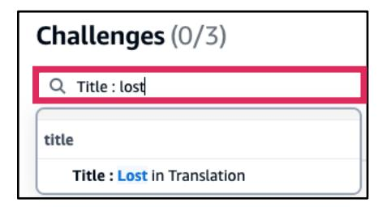

*チャレンジ*パネルには、特定のフィルターが適用されたチャレンジのリストが表示されます。イベントにチャレンジを追加したい場合は、*チャレンジタイトル*の左側のボックスを**チェック**します。*チャレンジ*数は、表示されている利用可能なチャレンジから選択されたチャレンジ数で更新されます。

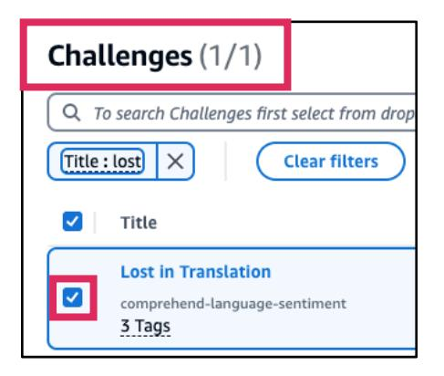

*現在選択されているチャレンジ*セクションも更新され、選択したすべてのチャレンジが表示されます。**X**を選択してチャレンジを削除できます。

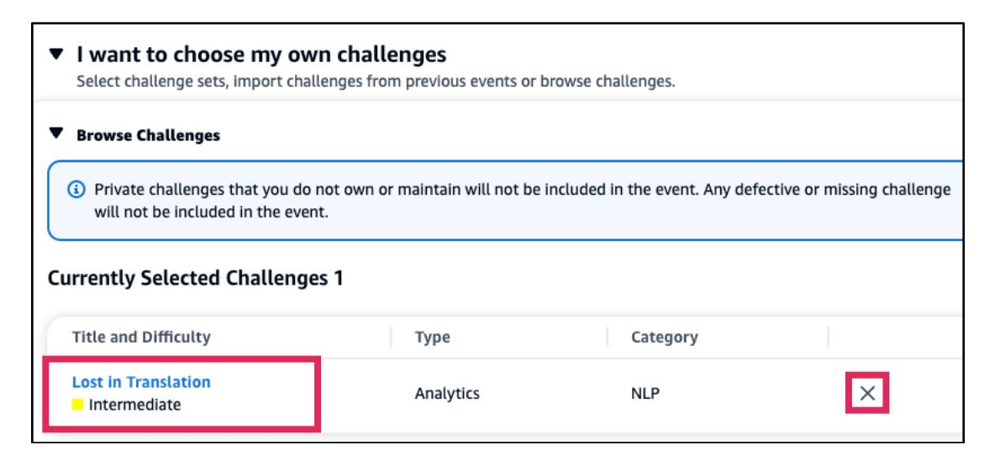

5. 2つ以上の*フィルター*のフィルターロジックを変更するには、2番目の**フィルタ**以降の左側にある**and**/**or**を選択します。各フィルターの右側の**X**を選択してフィルターを削除できます。追加したいチャレンジのチャレンジ名の横に**チェック**を追加します。

6. 主要なチャレンジのデプロイに問題がある場合にイベントで使用されるバックアップチャレンジを追加できます。**バックアップチャレンジ**を選択し、次に**一般的なバックアップチャレンジを追加**を選択します。

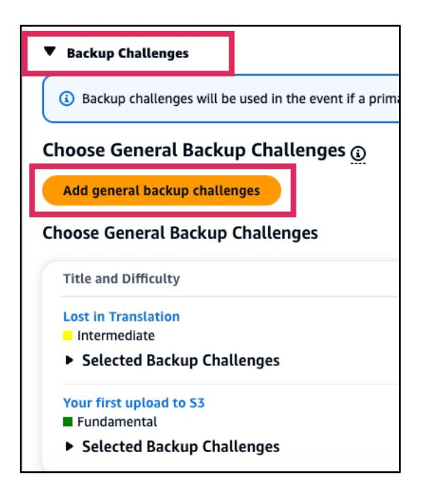

7. チャレンジセットも使用できます。**チャレンジセット**を選択し、次に*チャレンジセットを選択*ドロップダウンで**セット**を選択します。

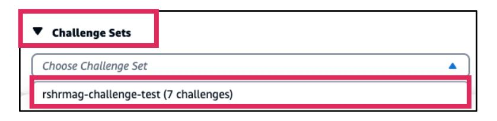

8. チャレンジの選択が完了したら、**Next**を選択します。

## *ステップ6 確認と作成（イベント詳細を確認してイベントを作成する方法）*

1. 確認と作成ページが表示されます。この6番目で最後のステップでは、確認のために完了したすべてのステップの詳細が表示されます。

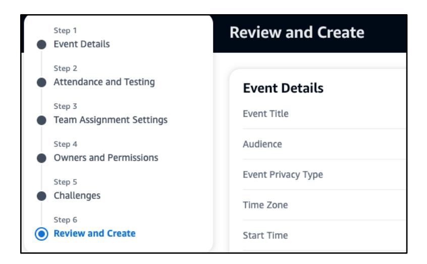

2. 各ステップの詳細を確認できます。特定のカテゴリで変更が必要な設定がある場合は、**Edit**を選択します。

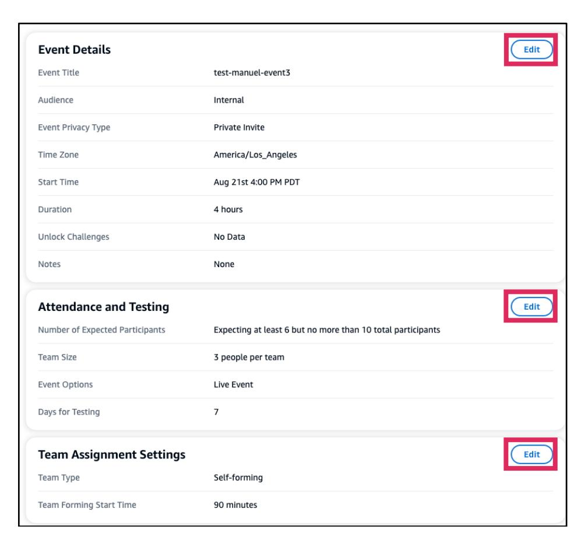

3. すべてのイベントステップの確認が完了したら、**Create Event Request**を選択します。

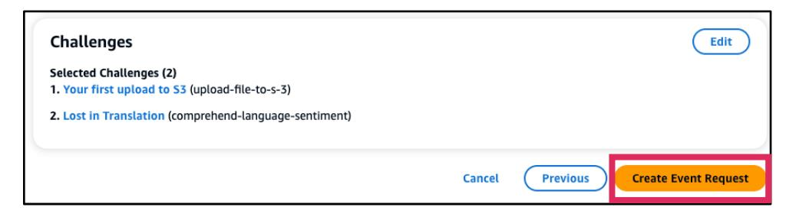

4. タイムライン、アクセス、イベント概要、チーム設定、準備ガイドなどの重要な情報を含むイベントページが表示されます。上部にイベント名を確認できます。

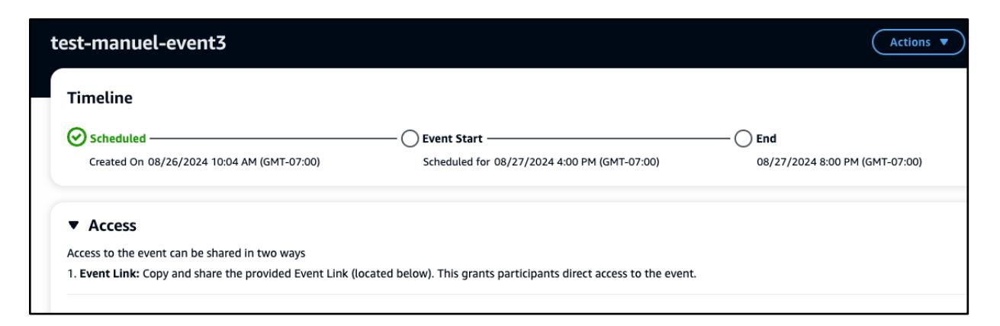

## 過去のイベントを予約する方法

*Schedule a Custom Jam Event*タスクのために、主催または参加した過去のイベントからチャレンジを選択できます。

1. Jamランディングページのナビゲーションで、**Host**に移動し、次に**Create a Custom Jam Event**を選択します。
2. *Challenges*ステップに到達するまですべてのステップを完了するか、前のステップをスキップして直接*Challenges*ステップに移動します。

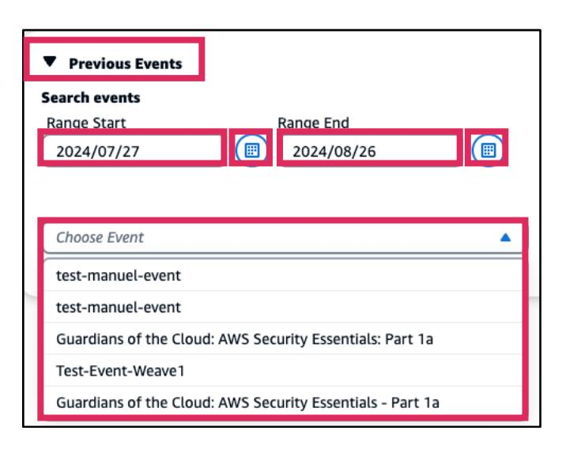

3. Previous Eventsパネルまでスクロールダウンして選択します。*Search events*で、**YYYY/MM/DD**形式で日付を入力するか、**カレンダーアイコン**を選択して日付を選択することで、*Range Start*と*Range End*を選択します。次に、*Choose Event*ドロップダウンでイベントを選択します。
> **📝 注記:** イベントが表示されない場合は、過去のイベントが選択した日付の間に含まれるように、Range StartとRange Endの日付を確認してください。

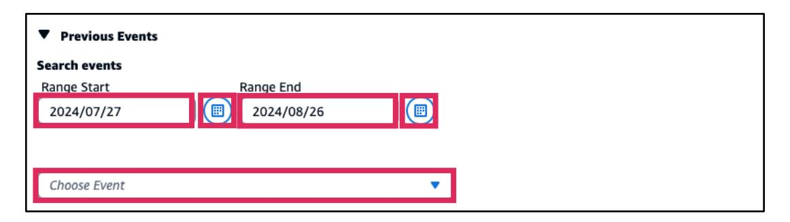

4. 選択した過去のイベントは、*Currently Selected Challenges*に過去のイベントのすべてのチャレンジを入力します。選択した過去のイベント名を確認できます。過去のイベントを使用したくない場合は、**X Remove**を選択します。

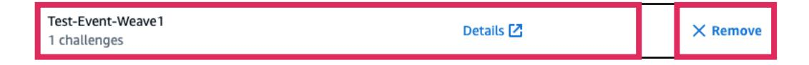
