# イベントの管理

--8<-- "source-notice-ja.md"

## 既存のイベントを管理する方法

既存のイベントの一覧ページには、各イベントの名前が表示されます。イベント管理ページで設定を確認し、必要に応じて変更を加えることができます。

1. Jamランディングページのナビゲーションで、**Host**を選択し、次に**Manage your existing events**を選択します。

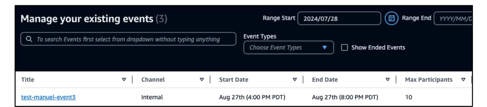

2. 既存のイベントの一覧ページが表示されます。イベントの*タイトル*、*チャンネル*、*開始日*、*終了日*、*最大参加者数*、*ステータス*を確認できます。

3. プロパティ、日付範囲、イベントタイプ、終了したイベントで検索を絞り込むことができます。

4. **検索**を選択し、何も入力せずにドロップダウンからプロパティを選択します。

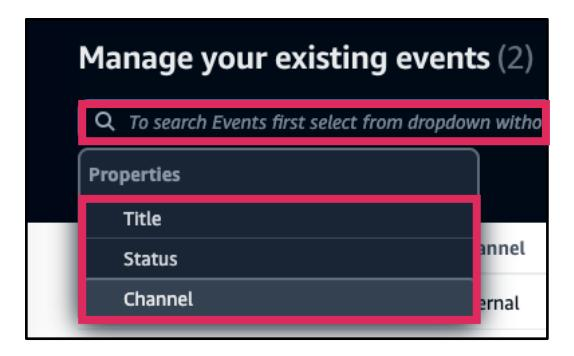

5. 日付範囲で検索することができます。**YYYY/MM/DD**形式で日付を入力するか、**カレンダーアイコン**を選択して日付を選択することで、*範囲開始*と*範囲終了*を選択します。

6. **終了したイベントを表示**ボックスを**チェック**して終了したイベントを表示します。*終了ステータス*のイベントが表示されます。

7. **列タイトル**を選択して、**昇順**と**降順**のソート順序を変更します。

8. 管理したいイベントの**タイトル**を選択します。

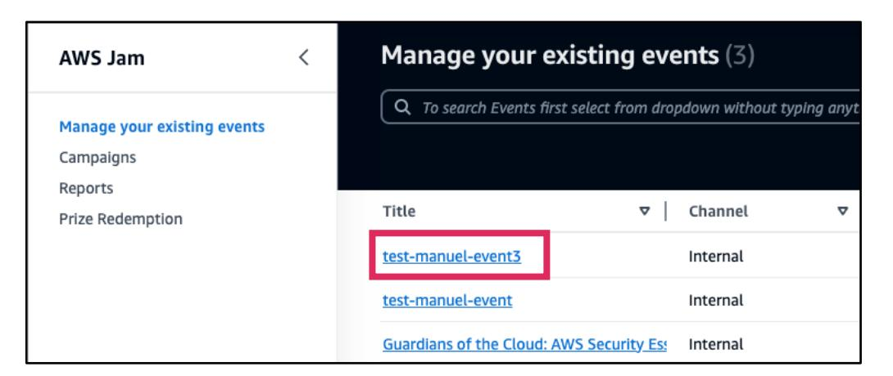

9. イベント管理ページには、タイムライン、イベントアクセス、イベント概要、チーム設定、準備ガイドなどのイベントの概要が表示されます。

10. *タイムライン*には、イベントに関する重要な日付と時間が表示されます。

11. *アクセス*パネルには、参加者と共有できる**イベントリンク**が表示されます。

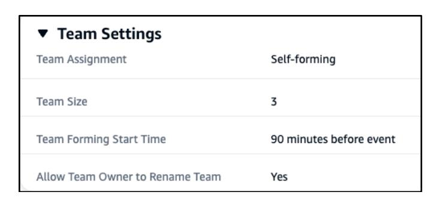

12. *イベント概要*パネルには、タイトル、開始および終了時間、参加者数、チャンネル、プライバシータイプなどのイベントの詳細が表示されます。

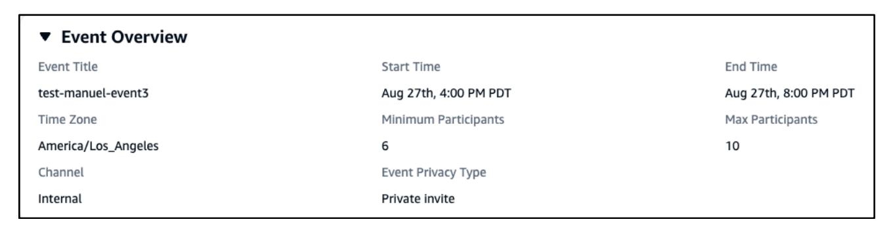

13. *チーム設定*パネルには、チーム割り当て、サイズ、形成開始時間、チーム名変更機能に関する情報が表示されます。

14. *準備ガイド*セクションには、以下の**FAQ**ページへのリンクが表示されます：*イベント主催者向け*、*ファシリテーター向け*、*学習者向け*。

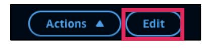

15. ページの右上の**Actions**を選択して、イベントに対して実行できるアクションを表示します：
	- a. **チャレンジをアンロック**: このオプションは、イベント開始時にチャレンジをアンロックします。
	> **📝 注記:** 自動的にアンロックするように設定していない場合、ファシリテーターが手動でチャレンジをアンロックする必要があります。
	- b. **このイベントを再度予約**: このオプションにより、選択したすべての設定とチャレンジを使用してこのイベントを再度作成できます。
	- c. **イベントをキャンセル**: このオプションにより、必要に応じてイベントをキャンセルできます。

16. *イベント概要*または*チーム設定*パネルの設定を変更する必要がある場合は、**Edit**を選択します。

17. 左側のメニューで**Challenges**リンクを選択して、選択したチャレンジを管理します。

18. *Selected Challenges*タブと*Selected Challenges*ページには、その横に選択されたチャレンジの総数が表示されます。*Max score*ポイントと、*Estimated Time For All Challenges*でイベントにかかる推定時間を確認できます。

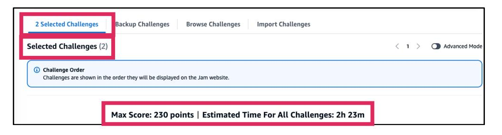

19. その下に各個別チャレンジの基本情報とともにチャレンジを確認することもできます。

20. *Selected Challenges*ページタイトルの右上にある**Advanced Modeをオン**にすることで、各チャレンジの詳細情報を確認できます。

21. Advanced Modeでは、*Average Solve Time*、*Last Solved*、*AWS Services*、*Tags*、*Average Deploy Time*、*Warmup*などのチャレンジに関する追加情報が表示されます。

## イベント管理機能

### イベントへのアクセス方法

1. Jamホームページのナビゲーションで、**Host**を選択し、次に**Manage your existing events**を選択します。

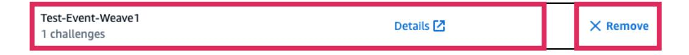

2. 既存のイベントの一覧ページには、各イベントの名前が表示されます。アクセスしたい**イベントタイトル**を選択します。

3. イベント管理ページが表示されます。

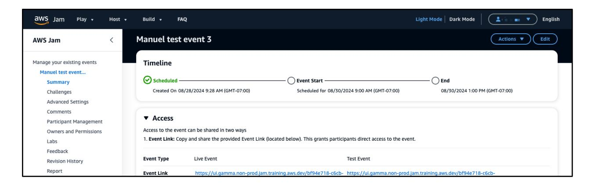

### イベントの参加者数を変更する方法

1. Jamホームページのナビゲーションで、**Host**を選択し、次に**Manage your existing events**を選択します。

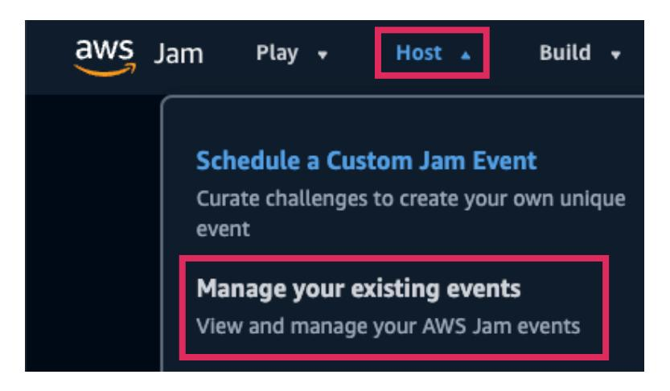

2. 既存のイベントの一覧ページには、各イベントの名前が表示されます。既存のイベントの**タイトル**を選択します。

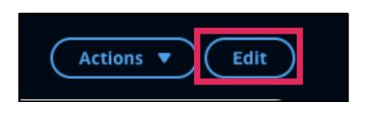

3. イベントページで、ページの右上の**Edit**を選択します。

4. *Event Overview*で、*Number of participants*に移動し、必要に応じて**Minimum participants**と**Number of participants**の**数**を変更します。

5. 完了したら、ページの右上の**Save**を選択します。

### イベントの時間と日付を変更する方法

1. Jamホームページのナビゲーションで、**Host**を選択し、次に**Manage your existing events**を選択します。

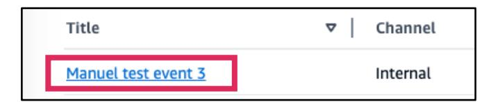

2. 既存のイベントの一覧ページには、各イベントの名前が表示されます。既存のイベントの**タイトル**を選択します。

3. イベントページで、ページの右上の**Edit**を選択します。

4. *Event Overview*パネルで、**Start Time**に移動し、**日付**と**開始時間**を変更します。

5. 完了したら、ページの右上の**Save**を選択します。

### Jamイベントをテストする方法

1. Jamホームページのナビゲーションで、**Host**を選択し、次に**Manage your existing events**を選択します。

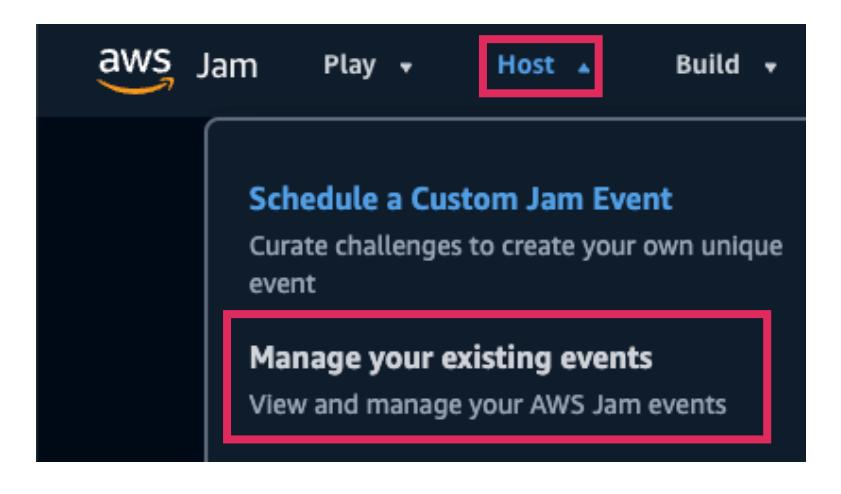

2. 既存のイベントの一覧ページには、各イベントの名前が表示されます。既存のイベントの**イベントタイトル**を選択してイベント管理ページを開きます。

3. *Access*パネルに移動してテスト*イベントリンク*を確認します。Event Linkには、Test Eventのイベントリンクが表示されます。リンクがない場合は、**Create Test Event**を選択します。

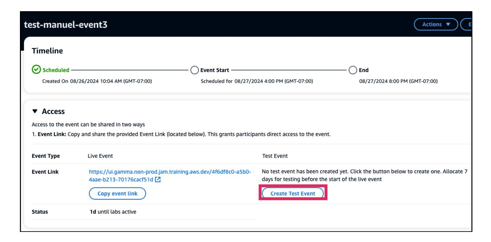

4. テストイベントリンクが作成され、表示されます。**テストイベントリンク**を選択して、新しいブラウザタブまたはウィンドウでテストイベントを開きます。**Copy secret key**を選択してテスターに送信します。
> **📝 注記:** テスターがテストイベントにアクセスするには、イベント主催者によって招待される必要があります。

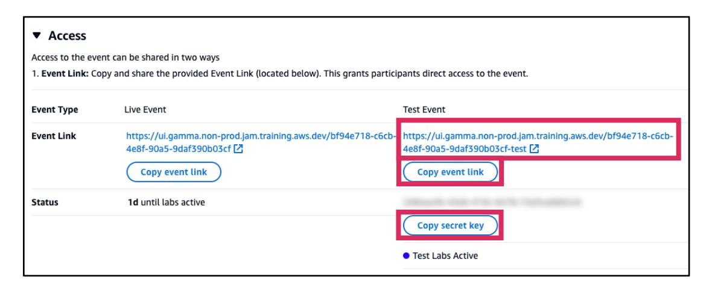

### チャレンジについて詳しく知る方法

1. Jamホームページのナビゲーションで、**Host**を選択し、次に**Manage your existing events**を選択します。

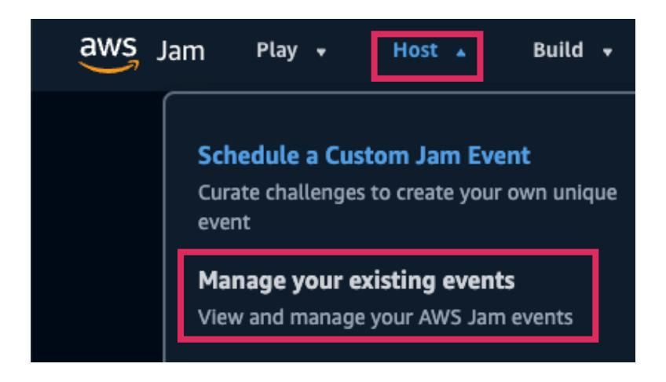

2. 既存のイベントの一覧ページには、各イベントの名前が表示されます。既存のイベントの**イベントタイトル**を選択してイベント管理ページを開きます。

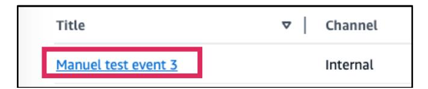

3. Challengesステップでチャレンジを閲覧します。詳しく知りたいチャレンジの**チャレンジタイトル**を選択します。

4. チャレンジ情報パネルが右側に表示されます。評価、難易度、説明アーキテクチャなどについて詳しく知ることができます。

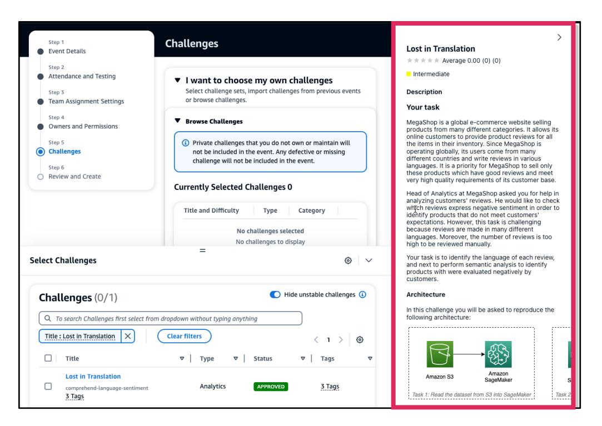

5. より大きなビューでチャレンジの詳細を確認するには、チャレンジ情報パネルを下にスクロールし、**Go to Challenge Details**を選択します。

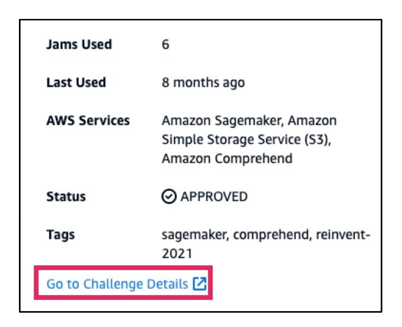

6. *チャレンジ詳細*ページが新しいブラウザウィンドウで開きます。より大きなビューのブラウザウィンドウで、チャレンジに関する追加の詳細を確認できます。

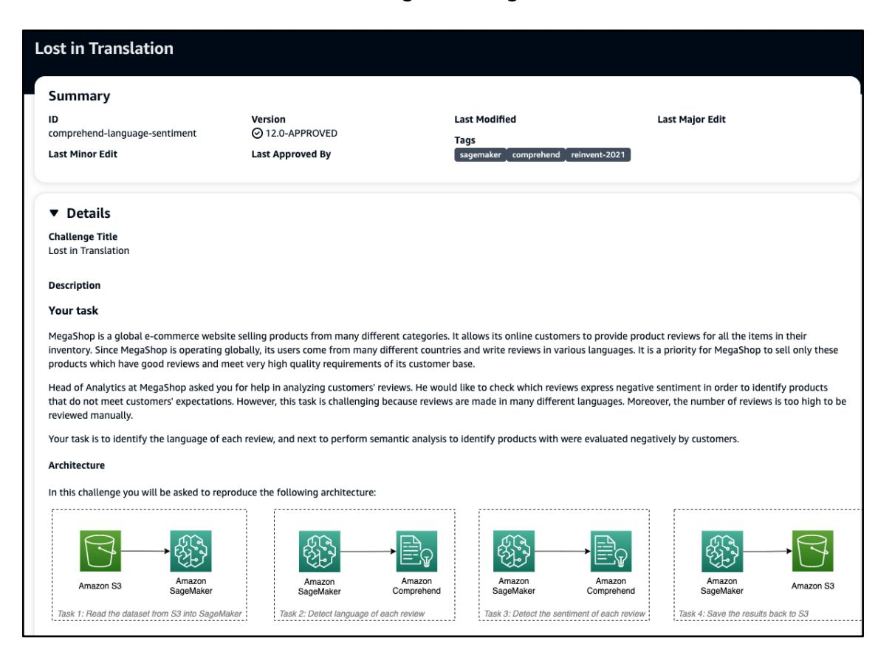
