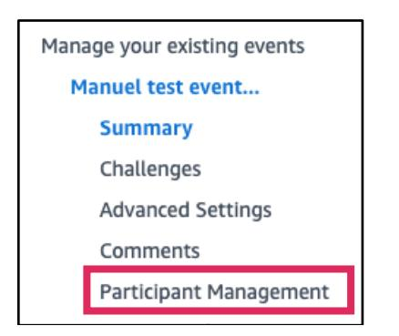
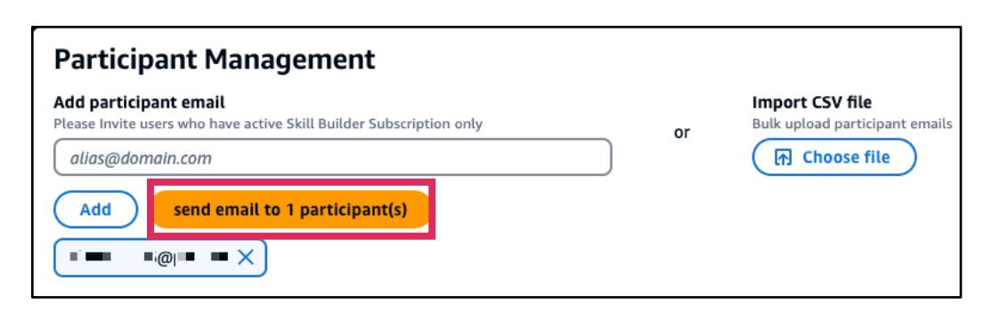
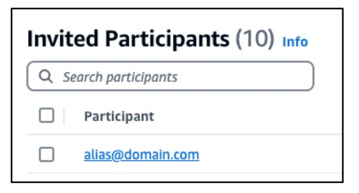

# 参加者の管理

--8<-- "source-notice-ja.md"

## イベントに参加者を招待する方法

イベントプライバシータイプに*Private invite*が設定されているイベントの場合、メールで参加者を招待します。参加者が*Invited Participants*リストに追加されていない場合、イベントに参加できません。
> **📝 注記:** *Private Code*が設定されているイベントの場合、参加者は*イベントリンク*を使用するか、Jamホームページナビゲーションの**Play**メニューの**Join an Event**で*秘密キー*を入力してイベントに参加できます。

**重要**: *Jam学習者がJamイベントに参加するには、Skill Builder Team Subscriberである必要があります。*

1. Jamホームページのナビゲーションで、**Host**を選択し、次に**Manage your existing events**を選択します。

2. 既存のイベントの一覧ページには、各イベントの名前が表示されます。アクセスしたい**イベントタイトル**を選択します。

3. イベント管理ページが表示されます。左側のイベント管理メニューで**Participant Management**を選択します。

4. *Participant Management*ページは、参加者を追加できる場所です。*Add participant email*で、一度に1つの*メール*のみを入力し、次に**Add**を選択します。

5. メール招待リストが表示されます。メールの入力が完了したら、**send email to (number) participant(s)**を選択します。

6. Save and Send Email Invitationパネルが表示され、追加された参加者数が確認されます。**send email to (number) participant(s)**を選択します。

7. *Invited Participants*リストが、最近招待された*participant email(s)*で更新されます。

## 一括アップロードを使用してイベントに参加者を招待する方法

手動で一つずつ入力する代わりに、CSVファイルを使用して一括で参加者を招待できます。

**重要**: *Jam学習者がJamイベントに参加するには、Skill Builder Team Subscriberである必要があります。*

1. Jamホームページのナビゲーションで、**Host**を選択し、次に**Manage your existing events**を選択します。

2. 既存のイベントの一覧ページには、各イベントの名前が表示されます。アクセスしたい**イベントタイトル**を選択します。

3. イベント管理ページが表示されます。左側のイベント管理メニューで**Participant Management**を選択します。

4. *Import CSV file*で複数のメールを追加できます。**Download template**を選択し、ファイル*InviteParticipantTemplate*をコンピューターのファイルシステムのどこかに保存します。

5. InviteParticipantTemplate.csvファイルを開き、招待者の**メール**を入力します。csvを**保存**します。

6. **Choose file**で、*csvファイル*を検索して**開く**します。

7. *CSV*名、サイズ、日付情報が表示されます。**Send Invite For Upload CSV**を選択します。

8. *Invited Participants*リストが、最近招待された*participant email(s)*で更新されます。

## イベントリンクを共有する方法

1. Jamホームページのナビゲーションで、**Host**を選択し、次に**Manage your existing events**を選択します。

2. 既存のイベントの一覧ページには、各イベントの名前が表示されます。アクセスしたい**イベントタイトル**を選択します。

3. イベント概要で*Access*パネルに移動してイベントリンクを見つけます。*Event Link*には、参加者がライブイベントに直接アクセスできるURL、またはテスターがテストイベントにアクセスできるURLが表示されます。**Copy event link**を選択し、お好みの方法で招待者またはテスターと共有します。

イベントプライバシータイプに*Private code*が設定されている場合、*Secret Key*が表示されます。秘密キーをコピーして参加者またはテスターに送信し、Jamホームページナビゲーションの"**Join an Event**"を使用してイベントに参加できるようにします。

