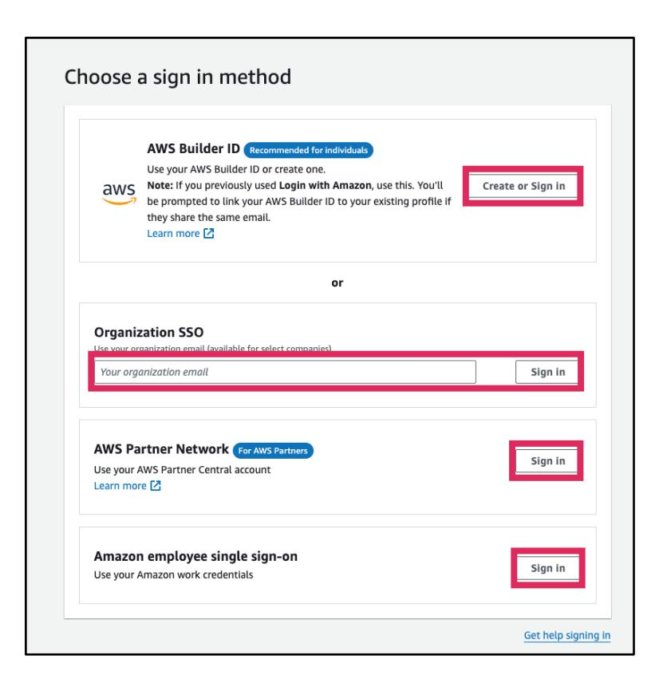
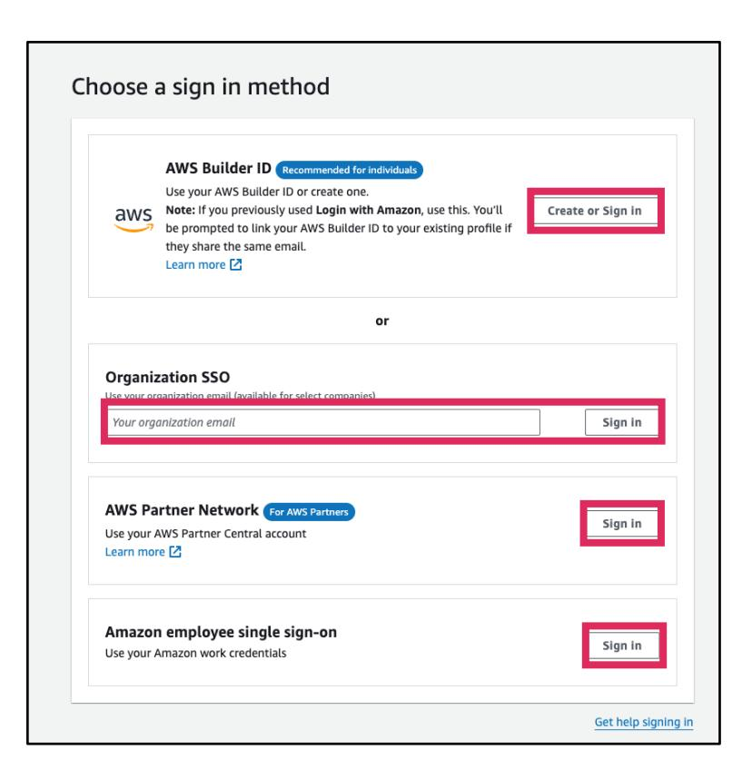
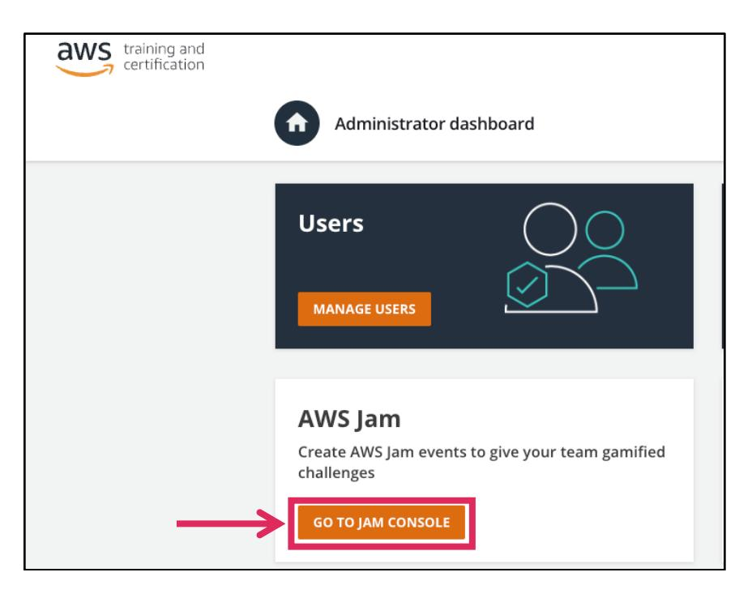
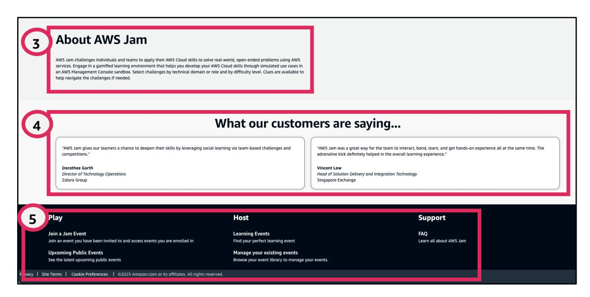
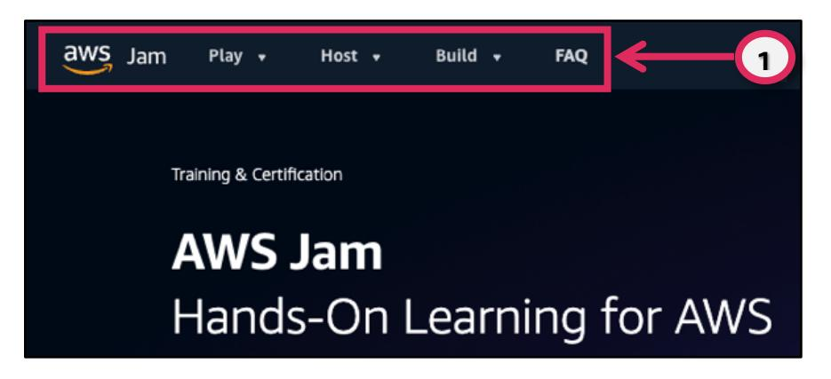
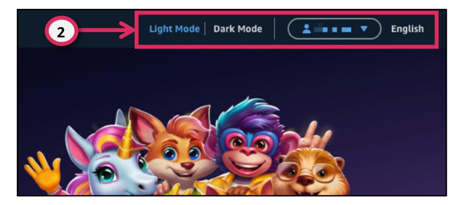
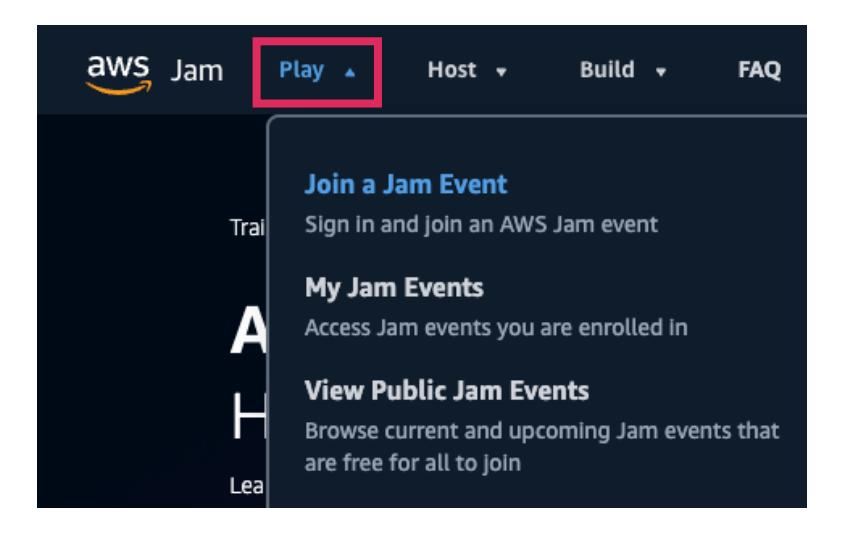
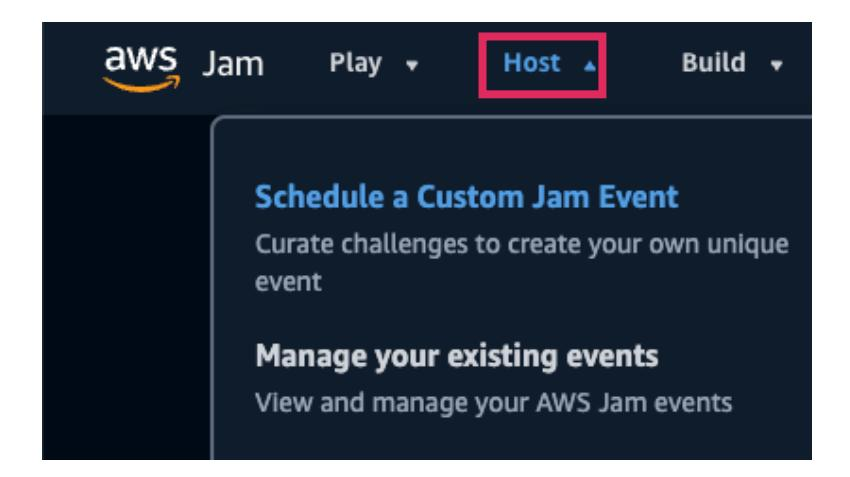
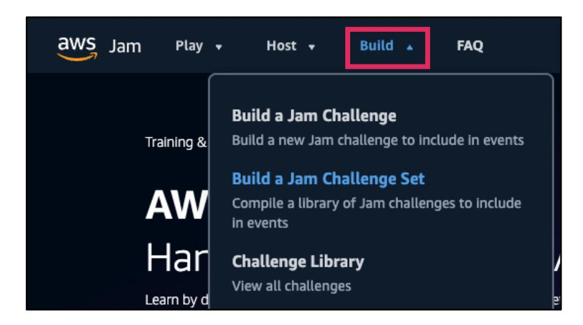
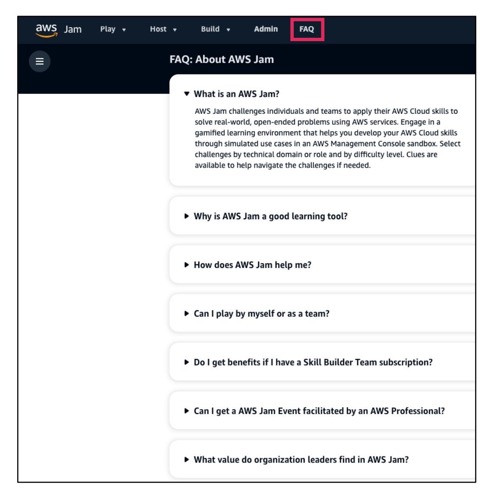

# Jam Overview

AWS Jam is an immersive experiential learning platform that helps learners develop the skills to build on the AWS Cloud through simulated real-world use-cases. Learners form teams to solve a series of challenges and engage in friendly competition to get the top position on the leaderboard. AWS Jam delivers an engaging experience through several gaming elements such as collaboration, competition, real-time scoring, and relevant in-scenario clues. Learners can get their hands dirty with 200+ challenges on topics such as security, DevOps, AI/ML, data analytics, migration tooling, serverless, application modernization, IoT, and more.

AWS Jam not only has the ability to identify whether the goals were achieved, but can also programmatically validate that the solution implements best practices that are known to scale effectively. This ensures that participants are learning established best practices which can then be taken back and implemented within their organizations.

## How AWS Jam works

AWS Jam challenges individuals and teams to apply their AWS Cloud skills to solve real-world, open-ended problems using AWS services. Engage in a gamified learning environment that helps you develop your AWS Cloud skills through simulated use cases in an AWS Management Console sandbox. Select challenges by technical domain or role and by difficulty level. Clues are available to help navigate the challenges if needed.

## Definitions

AWS Jam

- **Event**: A learning experience that is scheduled and time bound. During an event teams of participants attempt to solve a set of challenges (1-14) within an allotted time and compete against other teams to score the highest points. A majority of events are held in a physical location but virtual is also used.
- **Event owner**: The event owner is person responsible for planning, configuring the event parameters, selecting the challenges, hosting the live event, and reviewing the event statistics.
- **Experience**: A pre-configured event that contains a set of challenges. The challenges within an experience are typically aligned to the experience scenario theme and technical domain.
- **Campaign**: This is a type of Jam event that runs over multiple days. The challenges can be solved over a period of time.
- **Challenge**: A challenge is a key component of an event. It is a problem scenario that relates to common use cases, domains, and roles.
- **Challenge set**: A curated set of challenges that can be used to quickly add to an event during planning.
- **Facilitator**: A facilitator is a role in an event. The facilitator is responsible for delivering the event presentation and explains how a Jam works to

participants. They may also help participants answer questions during the challenge solution session and solve technical issues.

- **Participant**: A participant is someone that takes part in an event to attempt to solve challenges as a team. A participant is invited by the event owner to take part in a live event with multiple participants. A participant may take part in an on demand event by themselves.

## Accessing the Jam console

As an AWS Jam event owner, you'll have to access the AWS Jam console. > **📝 Note:** All Amazonians have access to the Jam console. Everyone else needs a Skill Builder Team Subscription (SBTS) to access the Jam console. See the section: *Accessing the Jam Console from Skill Builder*.

1. Open a web browser, and in the address bar enter the URL**: `https://jam.aws.com`.
2. In the Jam home page, select **Sign In** on the top right of the page.

3. Choose a sign in method for your account and select **Sign in**.

4. Enter your **username** and **password**. After logging in you can see the Jam home page. Skip the next section if you are not logging in using Skill Builder Team Subscription or Skill Builder Individual Subscription.

# Accessing the Jam Console from Skill Builder

If you have SBTS you can access Jam from the Skill Builder Admin Dashboard.

1. Open a web browser and in the address bar enter the URL**: `https://skillbuilder.aws`
2. Choose a sign in method for your SBTS enabled account and select **Sign in**.

3. In the Administrator Dashboard, find the *AWS Jam* panel. Then choose **GO TO JAM CONSOLE**.

4. The page displays the Jam home page.

## Jam home page

The Jam home page is where someone can participate in an AWS Jam AWS, create and manage events, and build challenges. The Jam home page has five main areas.

1. The Jam home page has a navigation menu on the top.
2. Below the navigation, you can join an event.

3. The lower half of the homepage has an About AWS Jam section.
4. There are also customer comments about Jam.
5. The very bottom has navigation to Play, Host, get Support, and legal links.

## Navigation

1. The top left of the navigation has menus for Jam participants, organizers, and builders to interact with events, challenges, and to learn more about Jam. There is the **Jam** home button, **Play**, **Host**, **Build**, and **FAQ** menu items.

> **📝 Note:** The Host and Build menus are not displayed for someone that is just a participant of an event.

2. The top right of the navigation is where you can customize your user experience. You can choose **Light Mode** or **Dark Mode**, access your **Profile**, **Sign Out**, and set your preferred language with **Set Language**.

## Play menu

A participant will find most of what you need to do in the play menu. The play menu is where someone can join an AWS Jam event, access Jam events they are enrolled in, and browse current and upcoming event that are free for all to join.

The Play menu includes the following items:

- ****Join a Jam Event****: Join an AWS Jam event
- ****My Jam Events****: Access Jam events you are enrolled in
- ****View Public Jam Events****: Browse current and upcoming Jam events that are free for all to join.

### Host menu

An event organizer will find most of what they need to do in the Host menu. The host menu is where an event organizer can browse curated experiences, schedule a Jam event, create a custom Jam event, manage their AWS Jam events, or create a campaign. The host menu does not display for participants.

The Host menu includes the following items:

- ****Schedule a Custom Jam Event****: Curate challenges to create your own custom event.
- ****Manage your existing events****: Browse current and upcoming Jam events that are free for all to join.

## Build menu

A challenge builder will find most of what they need to do in the build menu. The build menu is where a challenge builder can build a Jam challenge, build a Jam challenge set, and view all challenges in the library. The build menu does not display for users that do not have challenge builder privileges. You must request challenge builder privileges if you want to build a challenge.

The Build menu includes the following items:

- ****Build a Jam Challenge****: Build a new Jam challenge to include in events.
- ****Build a Jam Challenge Set****: Compile a library of Jam challenges to include in events.
- ****Challenge Library****: View all challenges.

## FAQ

The FAQ shows a list of general questions and answers about AWS Jam.

